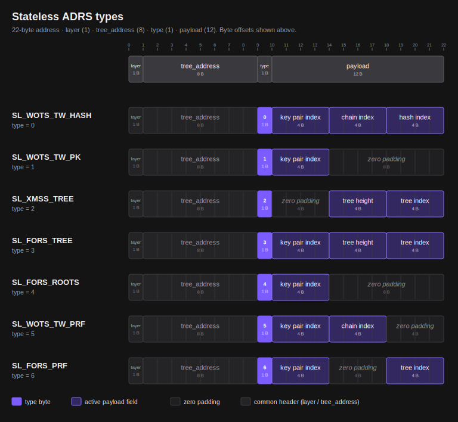
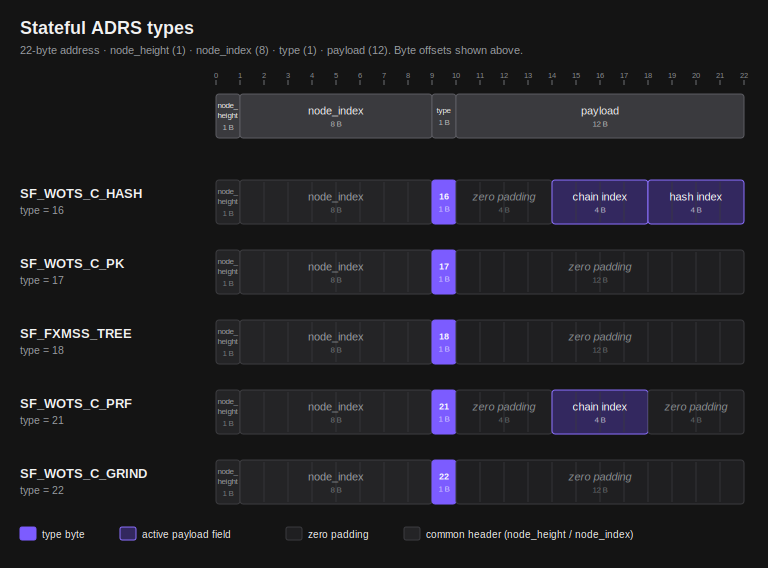
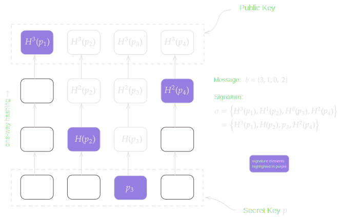
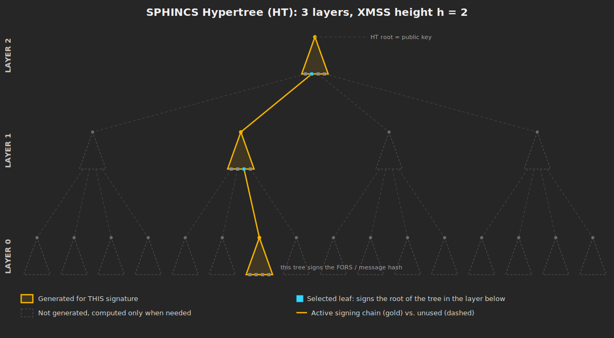
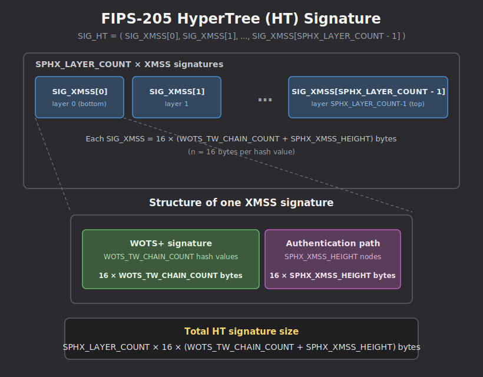
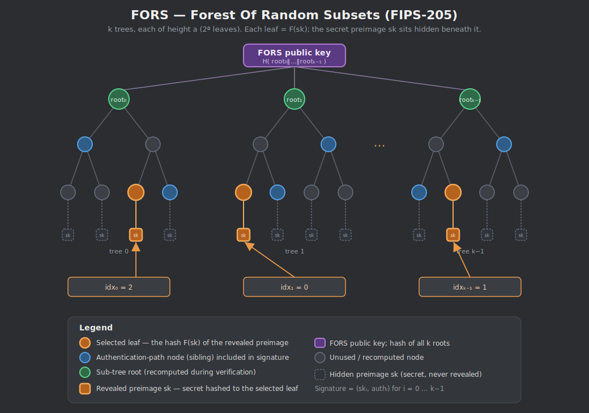
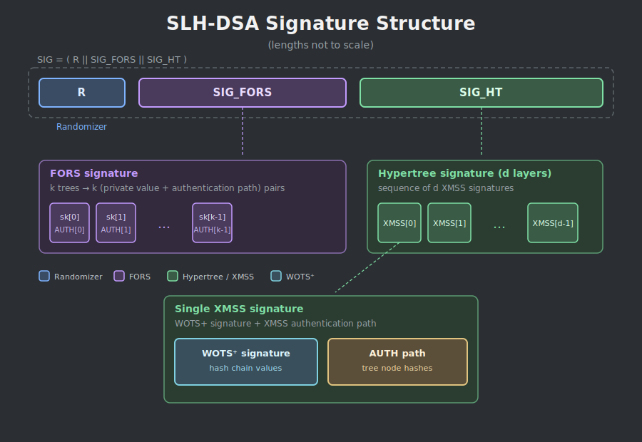

# SHRINCS

This document specifies SHRINCS (_Shrunken SPHINCS_), a hash-based signature scheme designed for transaction authorization in the Bitcoin protocol.

SHRINCS combines compact stateful hash-based signatures with a stateless fallback. It is instantiated with SHA256, targeting NIST security level 1: 128 bits of classical and 64 bits of quantum security. A security proof is TODO.

This specification describes the key generation, signing, and verification algorithms of SHRINCS.


## Templating

This SHRINCS specification includes Python reference code and documentation defined inline at [`impl/shrincs.py`](./impl/shrincs.py). The markdown file you are currently reading uses simple templating to pull Python code and docstrings from `shrincs.py`. If you wish to make changes to the specification of SHRINCS functions inside of a `<!-- DOC START xyz -->` ... `<!-- DOC END xyz -->` templating envelope, please make the changes directly in `shrincs.py` first, and then run the [`pydoc_insert.py` script](./pydoc_insert.py).

>[!WARNING]
> Running the templating script will overwrite SHRINCS.md. Make sure you have saved and committed other important changes first!

```sh
./pydoc_insert.py
```


## Overview

At a high level, a SHRINCS instance combines two hash-based signature schemes:

1. A **stateful** component — a flexible XMSS (FXMSS) tree of WOTS+C[^sphincs+c] one-time signatures.
2. A **stateless** component — a variant of SLH-DSA, with algorithms as defined in NIST FIPS-205[^slhdsa] but using a non-standard parameter set.

A signature from either component is sufficient to pass verification. The signer uses the stateful component as its compact, primary path, and falls back to the stateless component when signing state is unavailable.

The **stateful** component, FXMSS, generates small signatures. It is a variant of XMSS[^xmss]. In XMSS, the public key is the root of a Merkle tree whose leaves are one-time-signature public keys, and each signature is a single one-time signature together with the Merkle authentication path from its leaf to the root. The signer must maintain state so that no leaf is used to sign more than once.

FXMSS is _flexible_ in that the signer chooses the shape of the tree. An _unbalanced_ tree minimizes the size of the first few signatures but makes each subsequent signature larger, suiting signers that produce few signatures; a _balanced_ tree instead produces constant-size signatures.

The **stateless** component, a variant of SLH-DSA, generates larger signatures. SLH-DSA has a _signature budget_ — the maximum number of signatures it can produce before its security begins to degrade. Standard SLH-DSA supports a budget of 2<sup>64</sup> signatures; the non-standard parameter set used here reduces this to 2<sup>40</sup>, which in turn yields signatures smaller than SLH-DSA-SHA2-128s.

Each component produces a 16-byte root as part of its public key. These two roots, together with a 16-byte seed value, form the 48-byte SHRINCS public key:

```py
PK = PK.seed || PK.sl_root || PK.sf_root
```

Verification recomputes the relevant component's root from the signature and checks it against the corresponding root in `PK`: a stateful signature against `PK.sf_root`, a stateless signature against `PK.sl_root`.

Public key and signature sizes are summarized below:

| Item | Size |
|:--|:--|
| Public key | 48 bytes |
| Stateful signature | ≥ XXX bytes |
| Stateless signature | XXX bytes |


## Relation to SLH-DSA

The stateless component of SHRINCS uses SLH-DSA, defined in NIST FIPS-205. It is not exactly SLH-DSA as standardized, however: FIPS-205 approves only a fixed list of parameter sets, and the parameter set used here (see [Parameters](#parameters)) is not among them. The hash functions are instantiated with SHA256, as in the FIPS-205 parameter sets of the SHA2 family at security category 1.

The algorithms specified below, `slh_dsa_sign` and `slh_dsa_verify`, match the FIPS-205 algorithms `slh_sign` (Algorithm 22) and `slh_verify` (Algorithm 24), except in how the additional randomness used in signing is generated. An implementation of FIPS-205 that admits an arbitrary parameter set can therefore be used for the stateless component of SHRINCS.

This document nonetheless respecifies these algorithms in full, rather than referring to FIPS-205, in order to present both components of SHRINCS in one consistent notation. The exact correspondence is given in [the section on SLH-DSA](#slh-dsa) (TODO?).


## Parameters

Here follow the parameters of the stateful and the stateless component.

### Stateful Parameters

<!--Mike: Should we add the parameters for maximum depth of the stateful XMSS and maximum width of the stateful XMSS (255 and 2^32)? -->

| Parameter | Value | Description |
|:-:|:-:|:--|
| `WOTS_C_CHAIN_BITS` | <!-- CONST START WOTS_C_CHAIN_BITS -->4<!-- CONST END WOTS_C_CHAIN_BITS --> | The number of bits encoded by each Winternitz key chain. |
| `WOTS_C_CHAIN_COUNT` | <!-- CONST START WOTS_C_CHAIN_COUNT -->32<!-- CONST END WOTS_C_CHAIN_COUNT --> | The number of Winternitz chains. |
| `FXMSS_HEIGHT` | <!-- CONST START FXMSS_HEIGHT -->255<!-- CONST END FXMSS_HEIGHT --> | The imaginary height of the FXMSS tree, i.e. the maximum depth of a WOTS+C leaf node. |

### Stateless Parameters

The FIPS-205 column gives the name of the parameter in FIPS-205.

| Parameter | FIPS-205 | Value | Description |
|:-:|:-:|:-:|:--|
| — | `n` | 16 | The byte length of the hash outputs, i.e. the security parameter. It is not a named parameter in SHRINCS: every tweakable hash function truncates its output to 16 bytes. |
| `WOTS_TW_CHAIN_BITS` | `lg_w` | <!-- CONST START WOTS_TW_CHAIN_BITS -->4<!-- CONST END WOTS_TW_CHAIN_BITS --> | The number of bits encoded by each Winternitz key chain. |
| `WOTS_TW_CHAIN_COUNT1` | `len1` | <!-- CONST START WOTS_TW_CHAIN_COUNT1 -->32<!-- CONST END WOTS_TW_CHAIN_COUNT1 --> | The number of Winternitz message chains per WOTS key. |
| `WOTS_TW_CHAIN_COUNT2` | `len2` | <!-- CONST START WOTS_TW_CHAIN_COUNT2 -->3<!-- CONST END WOTS_TW_CHAIN_COUNT2 --> | The number of Winternitz checksum chains per WOTS key. |
| `WOTS_TW_CHAIN_COUNT` | `len` | <!-- CONST START WOTS_TW_CHAIN_COUNT -->35<!-- CONST END WOTS_TW_CHAIN_COUNT --> | The overall number of Winternitz chains per WOTS key. |
| `SPHX_LAYER_COUNT` | `d` | <!-- CONST START SPHX_LAYER_COUNT -->5<!-- CONST END SPHX_LAYER_COUNT --> | The number of XMSS layers in the SLH-DSA hypertree. |
| `SPHX_XMSS_HEIGHT` | `h'` | <!-- CONST START SPHX_XMSS_HEIGHT -->9<!-- CONST END SPHX_XMSS_HEIGHT --> | The height of each XMSS layer within the SLH-DSA hypertree. |
| `SPHX_FORS_HEIGHT` | `a` | <!-- CONST START SPHX_FORS_HEIGHT -->13<!-- CONST END SPHX_FORS_HEIGHT --> | The height of each FORS tree used in the SLH-DSA signature. |
| `SPHX_FORS_COUNT` | `k` | <!-- CONST START SPHX_FORS_COUNT -->10<!-- CONST END SPHX_FORS_COUNT --> | The number of FORS trees used in the SLH-DSA signature. |


## Derived Constants

The following constants are derived from the parameters above. We show formulas for how these are computed.

### Stateful Constants

| Constant | Value | Formula | Description |
|:-:|:-:|:-:|:-:|
| `WOTS_C_CHAINS_SIZE` | <!-- CONST START WOTS_C_CHAINS_SIZE -->512<!-- CONST END WOTS_C_CHAINS_SIZE --> | `WOTS_C_CHAIN_COUNT * 16` | The byte size of a full set of concatenated WOTS chain hashes. |
| `WOTS_C_CONSTANT_SUM` | <!-- CONST START WOTS_C_CONSTANT_SUM -->240<!-- CONST END WOTS_C_CONSTANT_SUM --> | `floor(WOTS_C_CHAIN_COUNT * (2**WOTS_C_CHAIN_BITS - 1) / 2)` | The most likely sum for Winternitz hash chain indexes. |
|`FXMSS_SIGNATURE_SIZE_MIN`| <!-- CONST START FXMSS_SIGNATURE_SIZE_MIN -->530<!-- CONST END FXMSS_SIGNATURE_SIZE_MIN --> | `2 + WOTS_C_CHAINS_SIZE + 16` | The minimum byte size of an FXMSS signature. |
|`FXMSS_SIGNATURE_SIZE_MAX`| <!-- CONST START FXMSS_SIGNATURE_SIZE_MAX -->4594<!-- CONST END FXMSS_SIGNATURE_SIZE_MAX --> | `2 + WOTS_C_CHAINS_SIZE + 16 * FXMSS_HEIGHT` | The maximum byte size of an FXMSS signature. |

### Stateless Constants

The FIPS-205 column gives the name of the parameter in FIPS-205.

| Constant | FIPS-205 | Value | Formula | Description |
|:-:|:-:|:-:|:-:|:-:|
| `WOTS_TW_CHAINS_SIZE` | <sub>(Not named in FIPS-205)</sub> | <!-- CONST START WOTS_TW_CHAINS_SIZE -->560<!-- CONST END WOTS_TW_CHAINS_SIZE --> | `WOTS_TW_CHAIN_COUNT * 16` | The byte size of a full set of concatenated WOTS chain hashes.  |
| `WOTS_TW_CHECKSUM_MAX` | `max_checksum` | <!-- CONST START WOTS_TW_CHECKSUM_MAX -->480<!-- CONST END WOTS_TW_CHECKSUM_MAX --> | `WOTS_TW_CHAIN_COUNT1 * (2**WOTS_TW_CHAIN_BITS - 1)` | The maximum possible sum of Winternitz hash chain indexes. |
| `SPHX_XMSS_SIGNATURE_SIZE` | <sub>(Not named in FIPS-205)</sub> | <!-- CONST START SPHX_XMSS_SIGNATURE_SIZE -->704<!-- CONST END SPHX_XMSS_SIGNATURE_SIZE --> | `WOTS_TW_CHAINS_SIZE + 16 * SPHX_XMSS_HEIGHT` | The byte size of a serialized XMSS signature.  |
| `HYPERTREE_SIGNATURE_SIZE` | <sub>(Not named in FIPS-205)</sub> | <!-- CONST START HYPERTREE_SIGNATURE_SIZE -->3520<!-- CONST END HYPERTREE_SIGNATURE_SIZE --> | `SPHX_LAYER_COUNT * SPHX_XMSS_SIGNATURE_SIZE` | The byte size of a hypertree signature. |
| `FORS_DIGEST_SIZE` | <sub>(Not named in FIPS-205)</sub> | <!-- CONST START FORS_DIGEST_SIZE -->17<!-- CONST END FORS_DIGEST_SIZE --> | `ceil(SPHX_FORS_COUNT * SPHX_FORS_HEIGHT / 8)` | The byte size of a FORS message digest. Contains enough bits to select a random index for each FORS tree. |
| `FORS_SIGNATURE_SIZE` | <sub>(Not named in FIPS-205)</sub> | <!-- CONST START FORS_SIGNATURE_SIZE -->2240<!-- CONST END FORS_SIGNATURE_SIZE --> | `16 * SPHX_FORS_COUNT * (SPHX_FORS_HEIGHT + 1)` | The byte size of a FORS signature. |
| `SPHX_SIGNATURE_SIZE` | <sub>(Not named in FIPS-205)</sub> | <!-- CONST START SPHX_SIGNATURE_SIZE -->5776<!-- CONST END SPHX_SIGNATURE_SIZE --> | `16 + FORS_SIGNATURE_SIZE + HYPERTREE_SIGNATURE_SIZE` | The byte size of an SLH-DSA signature. |
| `SPHX_TREE_INDEX_BITS` | <sub>(Not named in FIPS-205)</sub> | <!-- CONST START SPHX_TREE_INDEX_BITS -->36<!-- CONST END SPHX_TREE_INDEX_BITS --> | `SPHX_XMSS_HEIGHT * (SPHX_LAYER_COUNT - 1)` | The number of bits needed to represent the index of an XMSS tree in the hypertree. |
| <sub>(Not named in SHRINCS)</sub> | `h` | 45 | `SPHX_LAYER_COUNT * SPHX_XMSS_HEIGHT` | The total height of the SLH-DSA hypertree. |
| <sub>(Not named in SHRINCS)</sub> | `m` | 24 | `ceil(SPHX_FORS_HEIGHT * SPHX_FORS_COUNT / 8) + ceil(SPHX_XMSS_HEIGHT * (SPHX_LAYER_COUNT - 1) / 8) + ceil(SPHX_XMSS_HEIGHT / 8)` | The byte length of the message digest. |


## Keygen Inputs

Generating a SHRINCS key is straightforward and consists only of generating 48 random bytes. This is then split into 3 x 16-byte seeds.

- `SK.seed` is the core component of the secret key. Exposing this compromises the security of the keypair.
- `SK.prf` is a secret value used to derive per-message randomness.
- `PK.seed` is a salt value which is appended to the public key.

Note this is the bare minimum needed to generate a full SHRINCS public key. More performant (but larger) secret key representations are possible.


### Padding

Every SHRINCS keypair contains a randomly generated 16-byte salt value called `PK.seed` which is appended to the public key. This salts every hash function invocation to introduce domain separation between different instances of a signature scheme, to counter offline/precomputation attacks, and to reduce the chance that two hash invocations produce the same outputs for different SHRINCS keypairs.

To save computational effort, `PK.seed` is padded with zero bytes to a length of 64 bytes in most cases. This aligns with the SHA256 block size, so that `PK.seed` can be absorbed into the SHA256 state, and that midstate can be cached & reused.


## Utilities

We make use of the following utility helper functions in specifying SHRINCS.

- `ceil(x)`: rounds `x` up to the nearest whole number.
- `floor(x)`: rounds `x` down to the nearest whole number.
- `sum(x)`: sums a sequence of numbers `x`.
- `log2(x)`: returns the base-2 logarithm of `x` (a float/decimal).
- `repeat(b, n)`: returns a bytestring of length `n` containing only the repeated byte `b`.
- `zeros(n)`: returns a bytestring of  length `n` containing only repeated zero bytes.
- `range(start, end)`: returns the ascending sequence of all integers `i` such that `start <= i < end`.
- `concat(array)`: concatenates an array of byte strings.

Unless stated otherwise, all integers are serialized to and parsed from bytes as fixed-width, big-endian (network byte order) values, where the width is the size of the byte field the integer occupies.


### `base_2b(...)`

<!-- DOC START base_2b -->
Decomposes the bytes `x` into `outlen` groups of `b` bits which are each
parsed as an integer in the range `[0, 2**b)`. The leading `outlen * b` bits
of `x` are parsed, and so `x` must have accordingly sufficient length.

```py
def base_2b(x: bytes, b: int, outlen: int) -> list[int]:
  assert len(x) >= ceil(outlen * b / 8)

  baseb = [0] * outlen # output array
  j = 0                # counts the bytes read from the input x.
  acc = 0              # accumulator, collects bits from x
  bits_filled = 0      # counts the bits accumulated

  for i in range(outlen):
    while bits_filled < b:
      acc = (acc << 8) + x[j]
      j += 1
      bits_filled += 8

    bits_filled -= b
    baseb[i] = acc >> bits_filled
    acc %= 2**bits_filled # prevent accumulator from overflowing

  return baseb
```
<!-- DOC END base_2b -->


# Building Blocks

SHRINCS is a high-level construction built out of many smaller sub-schemes. To fully specify SHRINCS we start by defining the lowest level building blocks - addresses and the _hash functions_ and _pseudorandom functions_ (PRFs) - followed by the one-time signature schemes WOTS-TW and WOTS+C, and then the few-time signature scheme FORS, and finally we will move on to the higher-level constructions like XMSS and SLH-DSA, which together form SHRINCS.

```
     ADRS
        \
      hash functions
          & PRFs
        /         \
       /         /   \
      /         /      \
   WOTS+C   WOTS-TW   FORS
    /           \      /
   /             \    /
 FXMSS           SLH-DSA
    \      (contains XMSS)
     \           /
      \         /
       \       /
        SHRINCS
```


## ADRS

A critical security property of SHRINCS and its components is that every hash function invocation used in the verification algorithm must be _unique,_ so that inputs used in one hash function cannot be reused to produce the same output in another hash function.

To accomplish this goal, we will use _tweakable hash functions_ (explained below) which modify a hash function with some context-dependent location information. This unambiguously specifies the exact instance of the hash function in the signing/verification algorithms where the hash function is being used. This location is called an _address_ and we encode it into a 22-byte array, often called an `ADRS`.[^adrs]


### Stateless ADRS Format

| `ADRS` Field | Size | Purpose |
|:-:|:-:|:-:|
| `layer` | 1 byte | Specifies the layer in the SLH-DSA hypertree. The topmost layer is at layer `SPHX_LAYER_COUNT - 1`. |
| `tree_address` | 8 bytes | A 64-bit integer serialized with big-endian encoding. Specifies the index of an XMSS tree within a layer of the SLH-DSA hypertree. |
| `type` | 1 byte | A context-dependent flag which gives meaning to the remaining 12 bytes. |
| `payload` | 12 bytes | <br> Usage depends on the `type` field. <br> <br> |


### Stateful ADRS Format

| `ADRS` Field | Size | Purpose |
|:-:|:-:|:-:|
| `node_height` | 1 byte | Specifies the height of a node or leaf the FXMSS tree. The root node is at height `FXMSS_HEIGHT`. |
| `node_index` | 8 bytes | A 64-bit integer serialized with big-endian encoding. Specifies the node index (from the left) within a layer of the FXMSS tree. |
| `type` | 1 byte | A context-dependent flag which gives meaning to the remaining 12 bytes. |
| `payload` | 12 bytes | <br> Usage depends on the `type` field. <br> <br> |


### ADRS Types

| `ADRS` Type | Value | Purpose | Signing Path |
|:-:|:-:|:-:|:-:|
| `SL_WOTS_TW_HASH` | 0 | Used when iterating WOTS-TW hash chains. | Stateless |
| `SL_WOTS_TW_PK`  | 1 | Used when compressing WOTS-TW public keys. | Stateless |
| `SL_XMSS_TREE` | 2 | Used when combining merkle nodes in the SLH-DSA hypertree. | Stateless |
| `SL_FORS_TREE` | 3 | Used when combining merkle nodes in FORS trees. | Stateless |
| `SL_FORS_ROOTS` | 4 | Used when compressing FORS merkle roots together. | Stateless |
| `SL_WOTS_TW_PRF` | 5 | Used when generating WOTS-TW secret preimages. | Stateless |
| `SL_FORS_PRF` | 6 | Used when generating FORS secret preimages. | Stateless |
| `SF_WOTS_C_HASH` | 16 | Used when iterating WOTS+C hash chains. | Stateful |
| `SF_WOTS_C_PK`  | 17 | Used when compressing WOTS+C public keys. | Stateful |
| `SF_FXMSS_TREE` | 18 | Used when combining merkle nodes in the stateful FXMSS tree. | Stateful |
| `SF_WOTS_C_PRF` | 21 | Used when generating WOTS+C secret preimages. | Stateful |
| `SF_WOTS_C_GRIND` | 22 | Used when grinding WOTS+C message digests. | Stateful |


### ADRS Payloads

Each `ADRS` type gives different contextual meaning to the 12 bytes of the ADRS `payload` field. The following table describes how they are used under each ADRS type flag.

| Stateless `ADRS` Type | Payload Format | &nbsp;&nbsp;&nbsp;&nbsp;&nbsp;&nbsp;&nbsp;&nbsp;&nbsp;&nbsp; | Stateful `ADRS` Type | Payload Format |
|:-:|-|:-:|:-:|-|
| `SL_WOTS_TW_HASH` | 4 bytes: key pair index <br> 4 bytes: chain index <br> 4 bytes: hash index | | `SF_WOTS_C_HASH` | 4 bytes: zero padding <br> 4 bytes: chain index <br> 4 bytes: hash index |
| `SL_WOTS_TW_PK` | 4 bytes: key pair index <br> 8 bytes: zero padding | | `SF_WOTS_C_PK` | 12 bytes: zero padding |
| `SL_XMSS_TREE` | 4 bytes: zero padding <br> 4 bytes: tree height <br> 4 bytes: tree index | | `SF_FXMSS_TREE` | 12 bytes: zero padding |
| `SL_FORS_TREE` | 4 bytes: key pair index <br> 4 bytes: tree height <br> 4 bytes: tree index | | `SF_WOTS_C_PRF` | 4 bytes: zero padding <br> 4 bytes: chain index <br> 4 bytes: zero padding |
| `SL_FORS_ROOTS` | 4 bytes: key pair index <br> 8 bytes: zero padding | | `SF_WOTS_C_GRIND` | 12 bytes: zero padding |
| `SL_WOTS_TW_PRF` | 4 bytes: key pair index <br> 4 bytes: chain index <br> 4 bytes: zero padding | | | |
| `SL_FORS_PRF` | 4 bytes: key pair index <br> 4 bytes: zero padding <br> 4 bytes: tree index | | | |


The following figures show, for each `ADRS` type, how the 22-byte address is laid out: the common leading fields (`layer` and `tree_address` for stateless types, `node_height` and `node_index` for stateful types) and the `type` field, followed by the type-specific interpretation of the 12-byte `payload`. Field widths are drawn proportional to their byte sizes, with byte offsets along the top.



<sup>Stateless (`SL_*`) `ADRS` types, used along the SLH-DSA hypertree signing path.</sup>



<sup>Stateful (`SF_*`) `ADRS` types, used along the FXMSS signing path.</sup>


## Hash and Pseudorandom Functions

SHRINCS builds all of these functions from SHA256 as the base hash function, which we invoke as the primitive function `sha256(x)`, returning a 32-byte array. Outputs are often truncated, which we denote using Pythonic list-slicing notation: `sha256(x)[:16]`.

<!-- DOC START sha256 -->
The `sha256` hash function.

- Inputs:
  - `message`: a message of at most `2**61 - 1` bytes.
- Output:
  - a 32-byte hash.

```py
def sha256(message: bytes) -> bytes:
  return hashlib.sha256(bytes(message)).digest()
```
<!-- DOC END sha256 -->

SHA-256 accepts an input of at most `2**61 - 1` bytes: its padding encodes the message length in a 64-bit field that counts bits, so the input cannot exceed `2**64 - 1` bits. HMAC-SHA256 prepends a single 64-byte block to the message before hashing it, so `hmac_sha256` accepts at most `2**61 - 1 - 64` bytes. These two primitive limits are the root of every message-length bound in the scheme; the resulting cap on a SHRINCS message is derived in [Maximum Message Length](#maximum-message-length).

These functions fall into three families, described in the following sections: _tweakable hash functions_, _pseudorandom functions_, and _message digest functions_. Though built on the same primitive, they play conceptually distinct roles and are relied on for different security properties.


### Tweakable Hash Functions

A tweakable hash function can be thought of as a hash function which supports additional independent parameters that scope it to a specific role. Concretely, each invocation is parameterized by a public parameter, `PK.seed`, and a tweak, the `ADRS`, so that the same input hashed at two different positions yields unrelated outputs.


#### `T_sl(...)`

<!-- DOC START T_sl -->
The `T_sl` tweaked hash function. Compresses `WOTS_TW_CHAIN_COUNT` Winternitz chain tips into a
single 16-byte hash.

- Inputs:
  - `pk_seed`: a 16-byte salt.
  - `ADRS`: a 22-byte address.
  - `M_l`: a `WOTS_TW_CHAINS_SIZE`-byte concatenation of chain tips.
- Output:
  - a 16-byte hash.

This function is only used in the stateless path, and by both the signer and the verifier.

```py
def T_sl(pk_seed: bytes, ADRS: bytearray, M_l: bytes) -> bytes:
  return sha256(pk_seed + zeros(48) + ADRS + M_l)[:16]
```
<!-- DOC END T_sl -->


#### `T_sf(...)`

<!-- DOC START T_sf -->
The `T_sf` tweaked hash function. Compresses `WOTS_C_CHAIN_COUNT` Winternitz chain tips into a
single 16-byte hash.

- Inputs:
  - `pk_seed`: a 16-byte salt.
  - `ADRS`: a 22-byte address.
  - `M_l`: a `WOTS_C_CHAINS_SIZE`-byte concatenation of chain tips.
- Output:
  - a 16-byte hash.

This function is only used in the stateful path, and by both the signer and the verifier.

```py
def T_sf(pk_seed: bytes, ADRS: bytearray, M_l: bytes) -> bytes:
  return sha256(pk_seed + zeros(48) + ADRS + M_l)[:16]
```
<!-- DOC END T_sf -->


#### `T_k(...)`

<!-- DOC START T_k -->
The `T_k` tweaked hash function. Compresses `SPHX_FORS_COUNT` FORS tree roots into a single
16-byte hash.

- Inputs:
  - `pk_seed`: a 16-byte salt.
  - `ADRS`: a 22-byte address.
  - `M_k`: a `SPHX_FORS_COUNT * 16`-byte concatenation of FORS tree roots.
- Output:
  - a 16-byte hash.

This function is only used in the stateless path, and by both the signer and the verifier.

```py
def T_k(pk_seed: bytes, ADRS: bytearray, M_k: bytes) -> bytes:
  return sha256(pk_seed + zeros(48) + ADRS + M_k)[:16]
```
<!-- DOC END T_k -->


#### `F(...)`

<!-- DOC START F -->
The `F` tweaked hash function. Hashes a single 16-byte input, to generate and iterate Winternitz
hash chains and to hash FORS leaves.

- Inputs:
  - `pk_seed`: a 16-byte salt.
  - `ADRS`: a 22-byte address.
  - `M_1`: a 16-byte hash.
- Output:
  - a 16-byte hash.

This function is used in both stateful and stateless paths, and by both the signer and the verifier.

```py
def F(pk_seed: bytes, ADRS: bytearray, M_1: bytes) -> bytes:
  return sha256(pk_seed + zeros(48) + ADRS + M_1)[:16]
```
<!-- DOC END F -->


#### `H(...)`

<!-- DOC START H -->
The `H` tweaked hash function. Combines a pair of 16-byte Merkle child nodes into their 16-byte
parent, building the Merkle trees in XMSS and FORS.

- Inputs:
  - `pk_seed`: a 16-byte salt.
  - `ADRS`: a 22-byte address.
  - `M_2`: a 32-byte concatenation of two child node hashes.
- Output:
  - a 16-byte hash.

This function is used in both stateful and stateless paths, and by both the signer and the verifier.

```py
def H(pk_seed: bytes, ADRS: bytearray, M_2: bytes) -> bytes:
  return sha256(pk_seed + zeros(48) + ADRS + M_2)[:16]
```
<!-- DOC END H -->


#### `H_grind(...)`

<!-- DOC START H_grind -->
The `H_grind` tweaked hash function. Maps a 32-byte `digest` and grinding `counter` into the
constant-sum message space for WOTS+C.

- Inputs:
  - `pk_seed`: a 16-byte salt.
  - `ADRS`: a 22-byte address.
  - `digest`: a 32-byte digest.
  - `counter`: a 16-bit unsigned integer.
- Output:
  - a 16-byte hash.

This function is only used in the stateful path, and by both the signer and the verifier.

```py
def H_grind(pk_seed: bytes, ADRS: bytearray, digest: bytes, counter: int) -> bytes:
  assert counter <= 0xFFFF
  return sha256(pk_seed + zeros(48) + ADRS[:10] + digest + zeros(4) + counter.to_bytes(2))[:16]
```
<!-- DOC END H_grind -->

The extra 4 bytes of padding before the counter ensures the counter lines up with the SHA256 message schedule boundaries.

Notice we only use the first 10 bytes of `ADRS`. This ensures the entire hash input fits inside a single SHA256 compression call, given the cached `PK.seed` input. The remaining 12 bytes are always zero padding.


### Pseudorandom Functions

A _pseudorandom function_ produces output indistinguishable from random to anyone who does not know its key. SHRINCS instantiates its two pseudorandom functions as _keyed hash functions_, that is, hash functions that take a dedicated key input alongside the message. Both are keyed by a secret: `PRF` is keyed by `SK.seed` and derives secret key material, while `PRF_msg` is keyed by `SK.prf` and derives the per-message randomizer. `PRF_msg` comes in a stateless and a stateful variant, `PRF_msg_sl` and `PRF_msg_sf`, both built on HMAC-SHA256[^hmac], which we invoke as the function `hmac_sha256(key, message)`.

#### `hmac_sha256(...)`

<!-- DOC START hmac_sha256 -->
The `hmac_sha256` keyed hash function.

- Inputs:
  - `key`: a key of at most 64 bytes.
  - `message`: a message of at most `2**61 - 1 - 64` bytes.
- Output:
  - a 32-byte hash.

```py
def hmac_sha256(key: bytes, message: bytes) -> bytes:
  assert len(key) <= 64
  padded_key = key + zeros(64 - len(key))
  inner = sha256(xor(padded_key, repeat(0x36, 64)) + message)
  return sha256(xor(padded_key, repeat(0x5C, 64)) + inner)
```
<!-- DOC END hmac_sha256 -->


#### `PRF(...)`

<!-- DOC START PRF -->
The `PRF` pseudorandom function. Derives a secret 16-byte preimage from `sk_seed`, for signing
and key generation.

- Inputs:
  - `pk_seed`: a 16-byte salt.
  - `sk_seed`: a 16-byte secret.
  - `ADRS`: a 22-byte address.
- Output:
  - a 16-byte hash.

This function is used in both stateful and stateless paths, but only by the signer.

```py
def PRF(pk_seed: bytes, sk_seed: bytes, ADRS: bytearray) -> bytes:
  return sha256(pk_seed + zeros(48) + ADRS + sk_seed)[:16]
```
<!-- DOC END PRF -->

Note the order of the arguments passed to `PRF` is _not_ the same order in which those arguments are processed by `sha256`. This aligns with definitions in FIPS-205[^slhdsa].


#### `PRF_msg_sl(...)`

<!-- TODO (Jonas): We call opt_rand a "randomness" in the description and "salt" in the inputs list, but a few lines below we say it's not necessarily a salt (deterministic variant) -->

<!-- DOC START PRF_msg_sl -->
The `PRF_msg_sl` pseudorandom function. Derives the per-message randomizer (salt) for the stateless path via
HMAC-SHA256.

- Inputs:
  - `sk_prf`: a 16-byte secret.
  - `opt_rand`: a 16-byte salt.
  - `M`: a variable-length message.
- Output:
  - a 16-byte hash.

This function is only used in the stateless path, and only by the signer.

`opt_rand` is set to either `pk_seed` (giving the "deterministic variant" of SLH-DSA[^slhdsa]),
or a 16-byte salt sampled from a secure RNG (the "hedged variant" of SLH-DSA, which increases
resistance to side-channel attacks).

```py
def PRF_msg_sl(sk_prf: bytes, opt_rand: bytes, M: bytes) -> bytes:
  return hmac_sha256(key=sk_prf, message=opt_rand + M)[:16]
```
<!-- DOC END PRF_msg_sl -->


#### `PRF_msg_sf(...)`

<!-- DOC START PRF_msg_sf -->
The `PRF_msg_sf` function. Derives the per-message randomizer (salt) for the stateful path via
HMAC-SHA256.

- Inputs:
  - `sk_prf`: a 16-byte secret.
  - `pk_seed`: a 16-byte salt.
  - `ADRS`: a 22-byte address.
  - `M`: a variable-length message.
- Output:
  - a 16-byte hash.

This function is only used in the stateful path, and only by the signer.

```py
def PRF_msg_sf(sk_prf: bytes, pk_seed: bytes, ADRS: bytearray, M: bytes) -> bytes:
  return hmac_sha256(key=sk_prf + repeat(0xFF, 48), message=pk_seed + ADRS[:9] + M)[:16]
```
<!-- DOC END PRF_msg_sf -->

The `sk_prf` is padded with `0xFF` up until it is 64 bytes long. This ensures domain separation between stateful and stateless paths.

We remove the randomization input option for the stateful path compared to `PRF_msg_sl` as the same WOTS+C instance can sign a message only once, but in a misuse scenario where the same message is queried for a signature under the same state, producing exactly the same signature will not constitute a forgery.

We only use the first 9 bytes of `ADRS`, because these bytes encode the position of the WOTS+C leaf in the FXMSS tree.


### Message Digest Functions

Signing does not hash the user's message directly. Instead, the message is compressed together with a randomizer `R` into a short digest, which the one-time and few-time signatures then sign. SHRINCS uses a different digest function on each path. The stateless `H_msg_sl` is a keyed hash function, keyed by `R`. The stateful `H_msg_sf` additionally binds the position of the signing leaf, and so takes a tweak (the `ADRS`) in addition to `R`; it is therefore a tweakable hash function rather than a plain keyed hash.

#### `H_msg_sl(...)`

<!-- DOC START H_msg_sl -->
The `H_msg_sl` message hash function. Produces the 32-byte signing digest for the stateless path.

- Inputs:
  - `R`: a 16-byte randomizer.
  - `pk_seed`: a 16-byte salt.
  - `sl_root`: the 16-byte stateless root hash.
  - `M`: a variable-length message.
- Output:
  - a 32-byte hash.

This function is only used in the stateless path, and by both the signer and the verifier.

Note that `pk_seed` is not padded in this keyed hash function.

```py
def H_msg_sl(R: bytes, pk_seed: bytes, sl_root: bytes, M: bytes) -> bytes:
  return sha256(R + pk_seed + sha256(R + pk_seed + sl_root + M) + zeros(4))
```
<!-- DOC END H_msg_sl -->

The 4-byte zero-padding at the end of the outer hash input ensures `H_msg_sl` satisfies FIPS-205[^slhdsa], wherein `H_msg_sl` is defined using MGF1-SHA-256[^mgf1].


#### `H_msg_sf(...)`

<!-- DOC START H_msg_sf -->
The `H_msg_sf` message hash function. Produces the 32-byte signing digest for the stateful path.

- Inputs:
  - `R`: a 16-byte randomizer.
  - `pk_seed`: a 16-byte salt.
  - `sf_root`: the 16-byte stateful root hash.
  - `ADRS`: a 22-byte address.
  - `M`: a variable-length message.
- Output:
  - a 32-byte hash.

This function is only used in the stateful path, and by both the signer and the verifier.

Note that `pk_seed` is not padded in this tweakable hash function.

```py
def H_msg_sf(R: bytes, pk_seed: bytes, sf_root: bytes, ADRS: bytearray, M: bytes) -> bytes:
  return sha256(R + pk_seed + ADRS[:9] + sha256(R + pk_seed + sf_root + ADRS[:9] + M))
```
<!-- DOC END H_msg_sf -->

Notice we only use the first 9 bytes of `ADRS`, because these bytes encode the position of the WOTS+C leaf in the FXMSS tree.

Unlike `H_msg_sl`, this function is a SHRINCS-specific construction and is **not** required to satisfy FIPS-205[^slhdsa]. This accounts for two intentional differences from `H_msg_sl`:

- There is no trailing 4-byte zero-padding on the outer hash. That padding exists only to make `H_msg_sl` match the MGF1-SHA-256[^mgf1] definition mandated by FIPS-205, which does not apply here.
- The WOTS+C leaf position given by `ADRS` is bound into both the inner and outer hash inputs. This domain-separates the stateful digest by the leaf used to sign it.


### Implementation Notes

- The only difference between `T_sf`, `T_sl`, `T_k`, `F`, and `H` is the byte-length of the third input parameter. They are defined as different hash functions for security.
- `PRF_msg_sl` may be replaced with an XOF such as MGF1-SHA-256 or SHAKE256, from which the caller can sample multiple randomizers for the purposes of grinding to implement hypertree pruning[^pruning] more efficiently. For security, the XOF itself needs to provide the required security guarantees of a PRF, and the XOF should absorb the same inputs as `PRF_msg_sl`.
- `F(...)` is the most performance-critical hash function to optimize, as it dominates the runtime of signing, keygen, and verification.
- The padded `PK.seed` should be absorbed into a SHA256 midstate which is cached and reused. **This doubles performance.**
- These tweakable hash functions often handle secret inputs like `SK.seed`, so implementations should be free of control flows which branch and leak side-channel information based on potentially-secret data. Inputs should not be copied in memory unless securely erased afterwards.
- Many of these hash functions are invoked on independent data, and so can be run in parallel. Platforms with access to vectorized (SIMD) instruction sets on x86[^simd_x86] or ARM[^simd_arm] CPUs may utilize them to parallelize SHA256[^sha256x8] to improve performance significantly: a factor of 4 or more in some cases.
- Implementors can use SHA2 hardware acceleration[^sha_ni], though this is best used to accelerate verification, not signing or keygen[^sha_ni_bench].


## WOTS Schemes

A _one-time signature_ (OTS) scheme restricts signers to creating at most one signature per keypair. If this assumption is broken by publishing distinct signatures, then adversaries will be capable of forging new ones. While limited in their practical utility, hash-based OTS schemes are a crucial building block to construct more advanced hash-based signature schemes.

The following two sections describe a pair of related one-time signature schemes: WOTS-TW and WOTS+C.

- WOTS+C is used for the stateful signing path.
- WOTS-TW is used for the stateless signing path.

Both WOTS-TW and WOTS+C are variants of the original _Winternitz one-time signature scheme_ (WOTS),[^merkle] but each has a distinct performance profile and features. WOTS-TW is standardized in SLH-DSA[^slhdsa] and so we use it to preserve compatibility. WOTS+C produces shorter signatures with faster and constant-time verification speed, but is not compatible with SLH-DSA and so we only use it on the stateful path where compatibility is not a concern. WOTS+C can also technically fail when signing, a rare edgecase which parameters must be carefully engineered to avoid.


### Informal Description

Here follows an intuitive description of Winternitz OTS (WOTS) schemes in general.

A WOTS private key is an array of secret preimages. Each preimage is hashed, and the output is then hashed again, and so on, forming a _chain_ of hashes. After some prescribed number of steps in the chain (iterating the hash function) we reach the _tip_ of the hash chain. The _tips_ of those hash chains form the Winternitz public key.

To sign, the key holder maps an approved message to a set of integers which each index a node in a hash chain, and reveals the hashes at those indexes as the Winternitz signature.

The verifier maps the message to those same integers as the signer did, and finishes computing the hash chains. If the signer revealed the correct nodes, then the verifier will have recomputed the same hash chain tips that compose the signer's public key.



<sup>This diagram illustrates a simplified example of WOTS, using 4 hash chains of length 4 to sign an 8-bit message.</sup>

As written this would be insecure: Adversaries could forge signatures by finding a message which maps to a higher set of indexes. WOTS-TW and WOTS+C differ only in their solutions to this problem: WOTS-TW appends additional "checksum" hash chains, while WOTS+C appends a small salt which the signer must grind to find a set of indexes which sum to a specific constant.


## WOTS Algorithm

Both WOTS schemes make use of the following common hash-chaining algorithm.


### `wots_chain_iter(...)`

<!-- DOC START wots_chain_iter -->
The WOTS hash chain iteration function. Iterates the hash chain from index `start` by `steps`
steps, returning the node at index `start + steps`. The `ADRS` must be prefilled so the hashes
are correctly tweaked.

- Inputs:
  - `node`: a 16-byte hash.
  - `start`: a 32-bit unsigned integer, the index of `node` in its hash chain.
  - `steps`: a 32-bit unsigned integer, the number of steps to take up the chain; `start + steps` must not exceed `2**32`.
  - `pk_seed`: a 16-byte salt.
  - `ADRS`: a 22-byte address.
- Output:
  - a 16-byte hash at index `start + steps`.

This function is used in both stateful and stateless paths, and by both the signer and the verifier.

```py
def wots_chain_iter(node: bytes, start: int, steps: int, pk_seed: bytes, ADRS: bytearray) -> bytes:
  for j in range(start, start+steps):
    ADRS[18:22] = j.to_bytes(4)
    node = F(pk_seed, ADRS, node)
  return node
```
<!-- DOC END wots_chain_iter -->


## WOTS-TW

WOTS-TW is the classic variant of Winternitz one-time signatures[^merkle] which uses a checksum to prevent forgeries. In WOTS-TW, a 128-bit message is mapped directly into an array of `WOTS_TW_CHAIN_COUNT1` hash chain indexes, and the checksum is simply the negation of the sum of those indexes. This checksum is then encoded into `WOTS_TW_CHAIN_COUNT2` hash chain indexes which are appended to the message indexes before signing and verification.

This process starts by breaking a 128-bit message into `WOTS_TW_CHAIN_COUNT1` integers of `WOTS_TW_CHAIN_BITS` bits each in the range `[0, 2**WOTS_TW_CHAIN_BITS)`. The maximum possible sum of those indexes would be if every index was equal to `2**WOTS_TW_CHAIN_BITS - 1`, so the maximum sum is

```py
WOTS_TW_CHECKSUM_MAX = WOTS_TW_CHAIN_COUNT1 * (2**WOTS_TW_CHAIN_BITS - 1)
```

This constant is also defined explicitly in the earlier [table of derived constants](#derived-constants).

Given an array of `msg_indexes`, the checksum can be computed by:

```py
checksum = WOTS_TW_CHECKSUM_MAX - sum(msg_indexes)
```

This checksum is then converted into `WOTS_TW_CHAIN_COUNT2` integers of `WOTS_TW_CHAIN_BITS` bits each, which are appended to the original `msg_indexes`.


### `wots_tw_message_to_indexes(...)`

<!-- DOC START wots_tw_message_to_indexes -->
The WOTS-TW message map function. Converts a 16-byte `message` into a checksummed array of
`WOTS_TW_CHAIN_COUNT` chain indexes in `[0, 2**WOTS_TW_CHAIN_BITS)`.

- Inputs:
  - `message`: a 16-byte hash.
- Output:
  - a checksummed array of `WOTS_TW_CHAIN_COUNT` `WOTS_TW_CHAIN_BITS`-bit unsigned integers.

This function is only used in the stateless path, and by both the signer and the verifier.

```py
def wots_tw_message_to_indexes(message: bytes) -> list[int]:
  msg_indexes = base_2b(message, WOTS_TW_CHAIN_BITS, WOTS_TW_CHAIN_COUNT1)
  checksum = WOTS_TW_CHECKSUM_MAX - sum(msg_indexes)

  checksum_indexes = [0] * WOTS_TW_CHAIN_COUNT2
  for i in range(WOTS_TW_CHAIN_COUNT2):
    checksum_indexes[WOTS_TW_CHAIN_COUNT2 - 1 - i] = checksum % (2**WOTS_TW_CHAIN_BITS)
    checksum >>= WOTS_TW_CHAIN_BITS

  return msg_indexes + checksum_indexes
```
<!-- DOC END wots_tw_message_to_indexes -->

<!-- DOC START wots_tw_message_to_indexes_alt -->
Alternative implementation, equivalent to `wots_tw_message_to_indexes` but using the
more complex FIPS-205 algorithm.

```py
def wots_tw_message_to_indexes_alt(message: bytes) -> list[int]:
  SPHX_WOTS_CHECKSUM_SHIFT = (8 - (WOTS_TW_CHAIN_BITS * WOTS_TW_CHAIN_COUNT2) % 8) % 8
  SPHX_WOTS_CHECKSUM_BYTE_LEN = ceil(WOTS_TW_CHAIN_COUNT2 * WOTS_TW_CHAIN_BITS / 8)
  msg_indexes = base_2b(message, WOTS_TW_CHAIN_BITS, WOTS_TW_CHAIN_COUNT1)
  checksum = (WOTS_TW_CHECKSUM_MAX - sum(msg_indexes)) << SPHX_WOTS_CHECKSUM_SHIFT
  checksum_bytes = checksum.to_bytes(SPHX_WOTS_CHECKSUM_BYTE_LEN)
  checksum_indexes = base_2b(checksum_bytes, WOTS_TW_CHAIN_BITS, WOTS_TW_CHAIN_COUNT2)
  return msg_indexes + checksum_indexes
```
<!-- DOC END wots_tw_message_to_indexes_alt -->

This algorithm is used by both signer and verifier, and **it is security-critical for both implementations to match.**

Note especially how the _low-order_ bits of the checksum are shifted off first, and they are inserted snugly at the very end of the checksum indexes, with some padding bits which are always zero in between them and the message indexes. The checksum bits are NOT appended directly to the message indexes.


#### Example

Consider the following message indexes:

```py
msg = [10, 11, 2, 2, 3, 12, 15, 8, 1, 2, 8, 2, 2, 10, 9, 13, 10, 11, 2, 2, 3, 12, 15, 8, 1, 2, 8, 2, 2, 10, 9, 13]
```

The checksum of these message indexes is:

```py
checksum = WOTS_TW_CHECKSUM_MAX - sum(msg)
         = 260
         = 0b100000100
```

The original message has a binary representation:

```
1010 1011 0010 ... 1010 1001 1101
```


After appending the checksum, the final checksummed index sequence should look like this:

```
1010 1011 0010 ... 1010 1001 1101 0001 0000 0100
                                  ^^^^^^^^^^^^^^
                                     checksum
```


### `wots_tw_pubkey_gen(...)`

<!-- DOC START wots_tw_pubkey_gen -->
The WOTS-TW public key generation function. Computes the 16-byte WOTS-TW public key at the
keypair location prefilled in `ADRS`.

- Inputs:
  - `sk_seed`: a 16-byte secret.
  - `pk_seed`: a 16-byte salt.
  - `ADRS`: a 22-byte address.
- Output:
  - a 16-byte hash representing the WOTS-TW public key.

This function is only used in the stateless path, and only by the signer.

```py
def wots_tw_pubkey_gen(sk_seed: bytes, pk_seed: bytes, ADRS: bytearray) -> bytes:
  wots_pk = [b''] * WOTS_TW_CHAIN_COUNT
  for i in range(WOTS_TW_CHAIN_COUNT):
    ADRS[9] = SL_WOTS_TW_PRF
    ADRS[14:18] = i.to_bytes(4) # chain index
    ADRS[18:22] = zeros(4) # zero hash index
    sk = PRF(pk_seed, sk_seed, ADRS)
    ADRS[9] = SL_WOTS_TW_HASH
    wots_pk[i] = wots_chain_iter(sk, 0, 2**WOTS_TW_CHAIN_BITS - 1, pk_seed, ADRS)

  ADRS[9] = SL_WOTS_TW_PK
  ADRS[14:22] = zeros(8)
  wots_pk_hash = T_sl(pk_seed, ADRS, concat(wots_pk))
  return wots_pk_hash
```
<!-- DOC END wots_tw_pubkey_gen -->


### `wots_tw_sign(...)`

<!-- DOC START wots_tw_sign -->
The WOTS-TW signing function. Produces a WOTS-TW signature on a 16-byte `message`, at the keypair
location prefilled in `ADRS`.

- Inputs:
  - `message`: a 16-byte message to sign.
  - `sk_seed`: a 16-byte secret.
  - `pk_seed`: a 16-byte salt.
  - `ADRS`: a 22-byte address.
- Output:
  - a `WOTS_TW_CHAINS_SIZE`-byte signature.

This function is only used in the stateless path, and only by the signer.

```py
def wots_tw_sign(message: bytes, sk_seed: bytes, pk_seed: bytes, ADRS: bytearray) -> bytes:
  indexes = wots_tw_message_to_indexes(message)
  signature = [b''] * WOTS_TW_CHAIN_COUNT
  for i in range(WOTS_TW_CHAIN_COUNT):
    ADRS[9] = SL_WOTS_TW_PRF
    ADRS[14:18] = i.to_bytes(4)  # chain index
    ADRS[18:22] = zeros(4) # zero hash index
    sk = PRF(pk_seed, sk_seed, ADRS)
    ADRS[9] = SL_WOTS_TW_HASH
    signature[i] = wots_chain_iter(sk, 0, indexes[i], pk_seed, ADRS)
  return concat(signature)
```
<!-- DOC END wots_tw_sign -->


### `wots_tw_pubkey_from_sig(...)`

<!-- DOC START wots_tw_pubkey_from_sig -->
The WOTS-TW verification function. Recovers a WOTS-TW public key from a `signature` on a 16-byte
`message`.

- Inputs:
  - `signature`: a `WOTS_TW_CHAINS_SIZE`-byte signature.
  - `message`: a 16-byte message.
  - `pk_seed`: a 16-byte salt.
  - `ADRS`: a 22-byte address.
- Output:
  - a 16-byte hash representing the WOTS-TW public key.

This function is only used in the stateless path, and by both the signer and the verifier.

```py
def wots_tw_pubkey_from_sig(signature: bytes, message: bytes, pk_seed: bytes, ADRS: bytearray) -> bytes:
  indexes = wots_tw_message_to_indexes(message)
  wots_pk = [b''] * WOTS_TW_CHAIN_COUNT
  ADRS[9] = SL_WOTS_TW_HASH
  for i in range(WOTS_TW_CHAIN_COUNT):
    ADRS[14:18] = i.to_bytes(4)
    steps = 2**WOTS_TW_CHAIN_BITS - 1 - indexes[i]
    wots_pk[i] = wots_chain_iter(signature[i*16 : (i+1)*16], indexes[i], steps, pk_seed, ADRS)

  ADRS[9] = SL_WOTS_TW_PK
  ADRS[14:22] = zeros(8)
  wots_pk_hash = T_sl(pk_seed, ADRS, concat(wots_pk))
  return wots_pk_hash
```
<!-- DOC END wots_tw_pubkey_from_sig -->


## WOTS+C

WOTS+C was designed as an improvement to WOTS-TW[^sphincs+c]. It is superior in compactness & performance, but we nonetheless use WOTS-TW for the stateless path to retain compatibility with SLH-DSA[^slhdsa], while WOTS+C is used in the custom stateful component of SHRINCS to reduce signature size.

WOTS+C replaces the checksum in WOTS-TW with a protocol requirement that any message must be mapped to a set of indexes that sum to a fixed constant. This prevents WOTS forgeries because an incremental increase in any index of a hash chain must be balanced out by decrementing a different index. It also ensures a constant-time verifier because the total number of hash operations needed to complete every WOTS hash chain is fixed.

The constant-sum parameter `WOTS_C_CONSTANT_SUM` is chosen to maximize the probability that a randomly selected set of indexes will sum to this value. It can be computed by:

```py
WOTS_C_CONSTANT_SUM = floor(WOTS_C_CHAIN_COUNT * (2**WOTS_C_CHAIN_BITS - 1) / 2)
```

Only a subset of index-sets have this "constant-sum" property - for the chosen parameters, about 2<sup>122</sup> out of the possible 2<sup>128</sup> sets of indexes. To map a given message onto this subset, the signer must _grind_ a hash function applied to the message and a rolling integer counter. The hash function ensures the surjective mapping of messages to index-sets is one-way and distributed randomly. If the mapping were not one-way, an attacker could work backwards to find other messages valid under the same signature.

Eventually the signer finds a counter which maps the message to a set of indexes that sum to `WOTS_C_CONSTANT_SUM`. This counter is appended to the WOTS+C signature. The verifier rejects counters which don't map the message to a constant-sum index-set.


### `wots_c_grind_to_constant_sum(...)`

<!-- DOC START wots_c_grind_to_constant_sum -->
The WOTS+C grinding function. Grinds up to 2^16 counters until one maps `message_digest` to a
constant-sum index set, returning the lowest such counter and its index set.

- Inputs:
  - `pk_seed`: a 16-byte salt.
  - `message_digest`: a 32-byte intermediate message digest (from `H_msg_sf`).
  - `ADRS`: a 22-byte address.
- Outputs:
  - the smallest valid grinding `counter`: a 16-bit unsigned integer.
  - the constant-sum set of hash chain indexes it yields: `WOTS_C_CHAIN_COUNT` `WOTS_C_CHAIN_BITS`-bit unsigned integers.

This function is only used in the stateful path, and only by the signer.

```py
def wots_c_grind_to_constant_sum(pk_seed: bytes, message_digest: bytes, ADRS: bytearray) -> tuple[int, list[int]]:
  ADRS[9] = SF_WOTS_C_GRIND
  for i in range(2**16):
    hashed = H_grind(pk_seed, ADRS, message_digest, i)
    indexes = base_2b(hashed, WOTS_C_CHAIN_BITS, WOTS_C_CHAIN_COUNT)
    if sum(indexes) == WOTS_C_CONSTANT_SUM:
      return (i, indexes)

  raise RuntimeError("Unreachable") # practically impossible
```
<!-- DOC END wots_c_grind_to_constant_sum -->

We max out at 2<sup>16</sup> grinding attempts because the counter is serialized as a 16-bit unsigned integer in the WOTS+C signature encoding - Counters larger than this would not fit into a signature. There is technically a chance that the signer may exhaust all of these attempts without finding a valid counter, however we have engineered our parameter set such that this probability is less than 1 chance in 2<sup>1000</sup>[^wotsgrind] - practically impossible.


### `wots_c_map_digest(...)`

<!-- DOC START wots_c_map_digest -->
The WOTS+C digest validation function. Evaluates a signature's grinding `counter` and returns the
constant-sum index set it yields, or null if the counter is invalid.

- Inputs:
  - `pk_seed`: a 16-byte salt.
  - `message_digest`: a 32-byte intermediate message digest (from `H_msg_sf`).
  - `ADRS`: a 22-byte address.
  - `counter`: a 16-bit unsigned integer.
- Output:
  - a constant-sum set of hash chain indexes (`WOTS_C_CHAIN_COUNT` `WOTS_C_CHAIN_BITS`-bit unsigned integers), or null.

This function is only used in the stateful path, and only by the verifier.

```py
def wots_c_map_digest(pk_seed: bytes, message_digest: bytes, ADRS: bytearray, counter: int) -> Optional[list[int]]:
  ADRS[9] = SF_WOTS_C_GRIND
  hashed = H_grind(pk_seed, ADRS, message_digest, counter)
  indexes = base_2b(hashed, WOTS_C_CHAIN_BITS, WOTS_C_CHAIN_COUNT)
  if sum(indexes) == WOTS_C_CONSTANT_SUM:
    return indexes
  else:
    return None
```
<!-- DOC END wots_c_map_digest -->


### `wots_c_pubkey_gen(...)`

<!-- DOC START wots_c_pubkey_gen -->
The WOTS+C public key generation function. Computes the 16-byte WOTS+C public key at the keypair
location prefilled in `ADRS`.

- Inputs:
  - `sk_seed`: a 16-byte secret.
  - `pk_seed`: a 16-byte salt.
  - `ADRS`: a 22-byte address.
- Output:
  - a 16-byte hash representing the WOTS+C public key.

This function is only used in the stateful path, and only by the signer.

```py
def wots_c_pubkey_gen(sk_seed: bytes, pk_seed: bytes, ADRS: bytearray) -> bytes:
  wots_pk = [b''] * WOTS_C_CHAIN_COUNT
  ADRS[10:14] = zeros(4) # zeros reserved
  for i in range(WOTS_C_CHAIN_COUNT):
    ADRS[9] = SF_WOTS_C_PRF
    ADRS[14:18] = i.to_bytes(4) # chain index
    ADRS[18:22] = zeros(4) # zero hash index
    sk = PRF(pk_seed, sk_seed, ADRS)
    ADRS[9] = SF_WOTS_C_HASH
    wots_pk[i] = wots_chain_iter(sk, 0, 2**WOTS_C_CHAIN_BITS - 1, pk_seed, ADRS)

  ADRS[9] = SF_WOTS_C_PK
  ADRS[14:22] = zeros(8)
  wots_pk_hash = T_sf(pk_seed, ADRS, concat(wots_pk))
  return wots_pk_hash
```
<!-- DOC END wots_c_pubkey_gen -->


### `wots_c_sign(...)`

<!-- DOC START wots_c_sign -->
The WOTS+C signing function. Produces a WOTS+C signature on a 32-byte `message_digest`, at the
keypair location prefilled in `ADRS`.

- Inputs:
  - `message_digest`: a 32-byte message digest to sign.
  - `sk_seed`: a 16-byte secret.
  - `pk_seed`: a 16-byte salt.
  - `ADRS`: a 22-byte address.
- Output:
  - a `2 + WOTS_C_CHAINS_SIZE`-byte signature.

This function is only used in the stateful path, and only by the signer.

```py
def wots_c_sign(message_digest: bytes, sk_seed: bytes, pk_seed: bytes, ADRS: bytearray) -> bytes:
  counter, indexes = wots_c_grind_to_constant_sum(pk_seed, message_digest, ADRS)
  signature = [b''] * WOTS_C_CHAIN_COUNT

  ADRS[10:14] = zeros(4) # zeros reserved
  for i in range(WOTS_C_CHAIN_COUNT):
    ADRS[9] = SF_WOTS_C_PRF
    ADRS[14:18] = i.to_bytes(4)  # chain index
    ADRS[18:22] = zeros(4) # zero hash index
    sk = PRF(pk_seed, sk_seed, ADRS)
    ADRS[9] = SF_WOTS_C_HASH
    signature[i] = wots_chain_iter(sk, 0, indexes[i], pk_seed, ADRS)
  return counter.to_bytes(2) + concat(signature)
```
<!-- DOC END wots_c_sign -->


### `wots_c_pubkey_from_sig(...)`

<!-- DOC START wots_c_pubkey_from_sig -->
The WOTS+C verification function. Recovers a WOTS+C public key from a `signature` on a 32-byte
`message_digest`.

- Inputs:
  - `signature`: a `2 + WOTS_C_CHAINS_SIZE`-byte signature.
  - `message_digest`: a 32-byte message digest.
  - `pk_seed`: a 16-byte salt.
  - `ADRS`: a 22-byte address.
- Output:
  - a 16-byte hash representing the WOTS+C public key, or null.

This function is only used in the stateful path, and only by the verifier.

```py
def wots_c_pubkey_from_sig(signature: bytes, message_digest: bytes, pk_seed: bytes, ADRS: bytearray) -> Optional[bytes]:
  counter = int.from_bytes(signature[0:2])
  indexes = wots_c_map_digest(pk_seed, message_digest, ADRS, counter)

  # Reject if counter doesn't satisfy the constant-sum requirement.
  if indexes is None:
    return None

  wots_pk = [b''] * WOTS_C_CHAIN_COUNT
  ADRS[9] = SF_WOTS_C_HASH
  ADRS[10:14] = zeros(4) # zeros reserved
  for i in range(WOTS_C_CHAIN_COUNT):
    ADRS[14:18] = i.to_bytes(4)
    steps = 2**WOTS_C_CHAIN_BITS - 1 - indexes[i]
    wots_pk[i] = wots_chain_iter(signature[2+i*16 : 2+(i+1)*16], indexes[i], steps, pk_seed, ADRS)

  ADRS[9] = SF_WOTS_C_PK
  ADRS[14:22] = zeros(8)
  wots_pk_hash = T_sf(pk_seed, ADRS, concat(wots_pk))
  return wots_pk_hash
```
<!-- DOC END wots_c_pubkey_from_sig -->


## XMSS

The _eXtended Merkle Signature Scheme_ (XMSS) is a stateful hash-based signature scheme which can produce signatures on up to a fixed number of messages.

Conceptually, an XMSS keypair is a merkle tree whose leaves are one-time signature (OTS) keypairs. The XMSS public key is the root hash of the merkle tree. An XMSS signature is an OTS signature alongside a merkle tree authentication proof which links the OTS public key to the merkle root hash. The verifier recomputes the OTS public key, and follows the merkle proof to recompute the XMSS public key.

In SHRINCS, we instantiate XMSS twice, to be used differently in both stateful and stateless components of a SHRINCS keypair.

```
      XMSS (balanced)                  |             FXMSS (flexible)

           root                        |                 root
       ___/    \___                    |                /    \
      O            O                   |               O      L
     / \          / \                  |              / \
    O   O        O   O                 |             L   O
   / \ / \      / \ / \                |                / \
  L  L L  L    L  L L  L               |               L   L

                O = inner Merkle node    L = WOTS leaf (OTS keypair)
```

Both schemes are Merkle trees whose leaves are OTS keypairs and whose root is the public key. They differ only in shape: XMSS (stateless path) is always a perfectly balanced tree of fixed height, while FXMSS (stateful path) admits flexible structures, with WOTS+C leaves placed at varying depths.

- In the stateless component, traditional balanced XMSS is used with WOTS-TW as the leaf OTS scheme to certify child layers of the SLH-DSA hypertree, and to certify FORS public keys.
- In the stateful component, Flexible XMSS (FXMSS) is used with WOTS+C to sign messages directly.

In XMSS (stateless path), merkle trees are always perfectly balanced, and always have a fixed height `SPHX_XMSS_HEIGHT`. This aligns with FIPS-205 standards.

In FXMSS (stateful path), merkle trees can be balanced or unbalanced, and the WOTS+C leaf keys may be placed up to `FXMSS_HEIGHT` layers deep. This permits more flexible constructions.

Notably for security, XMSS is always used as part of the SPHINCS (SLH-DSA) framework to sign trusted messages generated by the signer, while FXMSS is used as a standalone scheme and so may sign untrusted messages. This means the interfaces of both XMSS and FXMSS are slightly different, and this is a crucial security requirement.

>[!note]
> ### On Merkle Tree Positions
>
> Every node in an XMSS or FXMSS merkle tree is identified by a pair of coordinates: a _height_ and an _index_.
>
> The index counts nodes from the left within a layer, starting at zero. The node at height `h` and index `i` has child nodes at indexes `2*i` (left) and `2*i + 1` (right) at height `h - 1`. Conversely, the ancestor of that node `j` layers above it has index `i >> j`, and the sibling of that ancestor has index `(i >> j) ^ 1`.
>
> More specifically for the different merkle tree constructions of XMSS, FXMSS, and FORS:
>
> - In XMSS, the WOTS-TW leaves sit at height 0, and the root sits at height `SPHX_XMSS_HEIGHT`. All leaves share a common layer.
> - In FXMSS, the WOTS+C leaves can sit at any height, and the root always sits at height `FXMSS_HEIGHT`. We often refer to a node's depth as its distance below the root: `depth = FXMSS_HEIGHT - height`. Because WOTS+C leaves may be placed at different depths, there is no common leaf layer. A leaf sits at height 0 only at the maximum depth of 255. In this sense `FXMSS_HEIGHT` is an "imaginary" height because no real FXMSS tree can fully explore the enormous possible space of 2<sup>256</sup> nodes.
> - In FORS, the preimage leaves sit at height 0, and the root of each of the merkle trees in the forest is at height `SPHX_FORS_HEIGHT`. All leaves share a common layer, but internally FORS tree node indexes count across the entire forest, and so the indexing scheme is more subtle. A node at index `i` in the `j`-th FORS tree at height `h` actually has a forest-wide index of `j * 2**(SPHX_FORS_HEIGHT - h) + i`, which is filled in the `tree_index` field in `ADRS` under the `SL_FORS_TREE` type. In other words, the index of a FORS node or leaf must account for all the other nodes to its left at the same height in the other FORS trees.
>
> When merkle nodes are combined with the hash function `H`, the coordinates written into the `ADRS` are those of the node being computed (the parent), not of its children. In XMSS, the tree height field of an `SL_XMSS_TREE` address therefore only takes values 1 through `SPHX_XMSS_HEIGHT` - Leaf nodes are not addressed by tree coordinates at all, but through the WOTS-TW keypair index, which equals the leaf's index at height 0. In FXMSS (stateful path), a WOTS+C leaf's coordinates are carried in the `node_height` and `node_index` fields of `ADRS`.

The following sections describe the XMSS and FXMSS algorithms.


## XMSS (stateless)

These algorithms are used only for the stateless XMSS sub-scheme.


### `xmss_node(...)`

<!-- DOC START xmss_node -->
The XMSS internal node computation function. Recursively computes the XMSS node at the given
`node_index` and `node_height`. The `ADRS` must be prefilled with the location of the XMSS tree
in the hypertree to ensure the hashes are properly tweaked.

- Inputs:
  - `sk_seed`: a 16-byte secret.
  - `node_index`: a 32-bit unsigned integer, the index (from the left) of the node in the XMSS layer.
  - `node_height`: a 32-bit unsigned integer, the height (from the bottom) of the node in the XMSS layer.
  - `pk_seed`: a 16-byte salt.
  - `ADRS`: a 22-byte address.
- Output:
  - a 16-byte XMSS node hash.

This function is only used in the stateless path, and only by the signer.

```py
def xmss_node(sk_seed: bytes, node_index: int, node_height: int, pk_seed: bytes, ADRS: bytearray) -> bytes:
  if node_height == 0: # Bottom layer: return the WOTS-TW pubkey hash.
    ADRS[10:14] = node_index.to_bytes(4)
    return wots_tw_pubkey_gen(sk_seed, pk_seed, ADRS)

  # Recursively derive the left/right child nodes.
  lchild_index = 2 * node_index
  child_height = node_height - 1
  lchild = xmss_node(sk_seed, lchild_index, child_height, pk_seed, ADRS)
  rchild = xmss_node(sk_seed, lchild_index + 1, child_height, pk_seed, ADRS)

  # Compute and return the parent node.
  ADRS[9] = SL_XMSS_TREE
  ADRS[10:14] = zeros(4)
  ADRS[14:18] = node_height.to_bytes(4)
  ADRS[18:22] = node_index.to_bytes(4)
  return H(pk_seed, ADRS, lchild + rchild)
```
<!-- DOC END xmss_node -->


### `xmss_sign(...)`

<!-- DOC START xmss_sign -->
The XMSS signing function. Produces a deterministic WOTS-TW signature at leaf `keypair_index` and
appends the Merkle authentication path to form an XMSS signature. The `ADRS` must be prefilled with
the location of the XMSS tree in the hypertree to ensure the hashes are properly tweaked.

- Inputs:
  - `message`: a 16-byte message to sign.
  - `sk_seed`: a 16-byte secret.
  - `keypair_index`: a 32-bit unsigned integer, the index of the WOTS-TW keypair to sign with.
  - `pk_seed`: a 16-byte salt.
  - `ADRS`: a 22-byte address.
- Output:
  - a `SPHX_XMSS_SIGNATURE_SIZE`-byte signature.

This function is only used in the stateless path, and only by the signer.

```py
def xmss_sign(message: bytes, sk_seed: bytes, keypair_index: int, pk_seed: bytes, ADRS: bytearray) -> bytes:
  ADRS[10:14] = keypair_index.to_bytes(4)
  sig = wots_tw_sign(message, sk_seed, pk_seed, ADRS)

  # Append the Merkle authentication path.
  for j in range(SPHX_XMSS_HEIGHT):
    sibling_index = (keypair_index >> j) ^ 1
    sig += xmss_node(sk_seed, sibling_index, j, pk_seed, ADRS)

  return sig
```
<!-- DOC END xmss_sign -->


### `xmss_pubkey_from_sig(...)`

<!-- DOC START xmss_pubkey_from_sig -->
The XMSS verification function. Recovers an XMSS root from a `signature` on a 16-byte `message`
at leaf `keypair_index`. The `ADRS` must be prefilled with the location of the XMSS tree in the
hypertree to ensure the hashes are properly tweaked.

- Inputs:
  - `keypair_index`: a 32-bit unsigned integer, the index of the WOTS-TW keypair to sign with.
  - `signature`: a `SPHX_XMSS_SIGNATURE_SIZE`-byte signature.
  - `message`: a 16-byte message.
  - `pk_seed`: a 16-byte salt.
  - `ADRS`: a 22-byte address.
- Output:
  - a 16-byte XMSS root node hash.

This function is only used in the stateless path, and by both the signer and the verifier.

```py
def xmss_pubkey_from_sig(keypair_index: int, signature: bytes, message: bytes, pk_seed: bytes, ADRS: bytearray) -> bytes:
  wots_sig = signature[0 : WOTS_TW_CHAINS_SIZE]
  xmss_auth = signature[WOTS_TW_CHAINS_SIZE : SPHX_XMSS_SIGNATURE_SIZE]

  ADRS[10:14] = keypair_index.to_bytes(4) # AKA keypair address
  node = wots_tw_pubkey_from_sig(wots_sig, message, pk_seed, ADRS)

  ADRS[9] = SL_XMSS_TREE
  ADRS[10:14] = zeros(4)

  for k in range(SPHX_XMSS_HEIGHT):
    ADRS[14:18] = (k + 1).to_bytes(4)
    ADRS[18:22] = (keypair_index >> (k+1)).to_bytes(4)
    sibling = xmss_auth[k*16 : (k+1)*16]
    if (keypair_index >> k) & 1 == 1:
      node = H(pk_seed, ADRS, sibling + node)
    else:
      node = H(pk_seed, ADRS, node + sibling)

  return node
```
<!-- DOC END xmss_pubkey_from_sig -->


## Hypertree Signing

The SHRINCS stateless path utilizes the design strategy of a _hypertree,_ first introduced by the original SPHINCS paper[^sphincs]. A hypertree is a tree of XMSS trees arranged into _layers_, where each OTS leaf signs the root hash of a child XMSS tree on the next layer down to certify the child tree's authenticity. Every child tree is thus verifiably connected to the root tree, in a similar fashion to TLS certificate chains. Each tree has `2**SPHX_XMSS_HEIGHT` such certified children.

Because each XMSS tree is generated deterministically from a seed, the signer does not need to worry about OTS key reuse when certifying child XMSS trees, and so she can avoid caching every XMSS tree in the hypertree. The signer can _just-in-time_ generate the XMSS trees that will be used for a specific signature, and thereafter those trees can be discarded from memory. This diagram shows a simplified example with three layers of XMSS trees with height 2.



A hypertree signature is simply a chain of `SPHX_LAYER_COUNT` XMSS signatures, starting from the bottom-layer which signs a given 16-byte message.



The following algorithms are used only for stateless hypertree signing and verification.

### `hypertree_sign(...)`

<!-- DOC START hypertree_sign -->
The hypertree signing function. Signs a 16-byte `message` through a hypertree of XMSS trees.

- Inputs:
  - `message`: a 16-byte message to sign.
  - `sk_seed`: a 16-byte secret.
  - `pk_seed`: a 16-byte salt.
  - `tree_index`: a 64-bit unsigned integer, the index (from the left) of the bottom-layer XMSS tree to sign with.
  - `leaf_index`: a 32-bit unsigned integer, the index (from the left) of the WOTS-TW key in the bottom-layer XMSS tree to sign with.
- Output:
  - a `HYPERTREE_SIGNATURE_SIZE`-byte signature.

This function is only used in the stateless path, and only by the signer.

```py
def hypertree_sign(message: bytes, sk_seed: bytes, pk_seed: bytes, tree_index: int, leaf_index: int) -> bytes:
  ADRS = bytearray(22)

  sig = b""
  for j in range(SPHX_LAYER_COUNT):
    ADRS[0] = j
    ADRS[1:9] = tree_index.to_bytes(8)
    layer_sig = xmss_sign(message, sk_seed, leaf_index, pk_seed, ADRS)
    if j < SPHX_LAYER_COUNT - 1:
      message = xmss_pubkey_from_sig(leaf_index, layer_sig, message, pk_seed, ADRS)
      leaf_index = tree_index % (2**SPHX_XMSS_HEIGHT)
      tree_index >>= SPHX_XMSS_HEIGHT
    sig += layer_sig

  return sig
```
<!-- DOC END hypertree_sign -->


### `hypertree_verify(...)`

<!-- DOC START hypertree_verify -->
The hypertree verification function. Recovers the hypertree root from a `signature` and compares
it against `sl_root`.

- Inputs:
  - `message`: a 16-byte message.
  - `signature`: a `HYPERTREE_SIGNATURE_SIZE`-byte signature.
  - `pk_seed`: a 16-byte salt.
  - `tree_index`: a 64-bit unsigned integer, the index (from the left) of the bottom-layer XMSS tree to sign with.
  - `leaf_index`: a 32-bit unsigned integer, the index (from the left) of the WOTS-TW key in the bottom-layer XMSS tree to sign with.
  - `sl_root`: the 16-byte root hash of the stateless root tree.
- Output:
  - a boolean indicating if the signature is valid.

This function is only used in the stateless path, and only by the verifier.

```py
def hypertree_verify(message: bytes, signature: bytes, pk_seed: bytes, tree_index: int, leaf_index: int, sl_root: bytes) -> bool:
  ADRS = bytearray(22)

  for j in range(SPHX_LAYER_COUNT):
    ADRS[0] = j
    ADRS[1:9] = tree_index.to_bytes(8)
    layer_sig = signature[j * SPHX_XMSS_SIGNATURE_SIZE : (j+1) * SPHX_XMSS_SIGNATURE_SIZE]
    message = xmss_pubkey_from_sig(leaf_index, layer_sig, message, pk_seed, ADRS)
    if j < SPHX_LAYER_COUNT - 1:
      leaf_index = tree_index % (2**SPHX_XMSS_HEIGHT)
      tree_index >>= SPHX_XMSS_HEIGHT
  return message == sl_root
```
<!-- DOC END hypertree_verify -->


## FXMSS

FXMSS is the stateful signing path of SHRINCS. FXMSS offers a unique paradigm in the genre of XMSS: Unlike most related schemes, FXMSS allows the signer to pick (almost[^fxmss_node_index]) any arbitrary tree structure. By tree structure, we mean the choice of which positions in the FXMSS tree are used by the signer as WOTS+C leaf nodes.

The FXMSS verifier does not care about the positions of unused WOTS+C leaf nodes - The verifier only cares about the WOTS+C leaf whose signature is attached in the FXMSS signature. This makes the verifier simpler to implement, and frees signers to select their XMSS tree structure at key generation time to suit their use-case.

Because of this flexibility, it is necessary for signers to remember what structure of FXMSS tree they created at key generation time. To encourage interoperability, we define an encoding for FXMSS tree structures which will be stored in the SHRINCS signer's serialized secret key as two additional bytes.

A _tree structure_ for FXMSS is encoded as a tuple of two numbers: ***shape*** and ***depth***.

- ***Shape*** is a flag byte that defines which FXMSS nodes are to be WOTS+C leaves. We will describe two recommended tree shapes below.
- ***Depth*** is an 8-bit unsigned integer describing the height of the FXMSS tree, or more precisely, the distance from the root node to the deepest leaf node.

These two parameters define the _structure_ of the FXMSS stateful path.

The shape and depth bytes will be encoded in the serialized SHRINCS secret key so that implementations which import the key have a clear directive for how to build the same FXMSS tree in the SHRINCS stateful path. Implementations which import SHRINCS keys MUST respect the shape and depth bytes - doing otherwise would be unsafe and may lead to forgeries and theft.


### Tree Shapes

We prescribe and define two FXMSS tree shapes: **Unbalanced XMSS (UXMSS)** and **Balanced XMSS (BXMSS)**. For clarity: We use the terms UXMSS and BXMSS in the context of signing and key-generation, while FXMSS refers more generally to the verifier, which is decoupled from tree shape.

The two shapes are identified by their respective constants.

| Shape Flag | Value | Description |
|:-:|:-:|:-:|
| `FXMSS_SHAPE_UNBALANCED` | 0 | Indicates UXMSS, with a left-leaning unbalanced tree. |
| `FXMSS_SHAPE_BALANCED` | 1 | Indicates BXMSS, with a balanced tree of specific depth. |
| ... | 2...255 | Reserved. |

We leave open the possibility to define new shape flags for new XMSS tree structures, but we encourage signers to utilize the recommended shapes wherever possible, for the sake of security and anonymity.

The following sections describe the usage properties of the two shapes, and we let the variable `depth` represent the depth byte as a parameter of the shape.


#### `FXMSS_SHAPE_UNBALANCED`

When the shape byte is set to `FXMSS_SHAPE_UNBALANCED`, signers use an unbalanced, left-leaning XMSS tree of height `depth`.

```
                   root
                  /    \
                 O    leaf
               /   \
              O   leaf
            /   \
           O   leaf
         /   \
       ...  leaf
       /
      O
    /   \
 leaf   leaf
```

This FXMSS tree shape allows signers to generate very short stateful signatures for the first few initial signatures, since the signer can use the shallowest WOTS+C leaves right away, and these have very short merkle authentication paths.

However, since each WOTS+C leaf can be used only once, subsequent signatures will grow larger at a rate of 16 bytes per signature issued as the merkle authentication path grows in length. Eventually after `depth + 1` signatures, the UXMSS stateful path will be exhausted and unusable, and the last few stateful signatures will be very large.

For most use cases, unless compute power is very limited, we recommend setting `depth = FXMSS_HEIGHT` for UXMSS (the maximum), as even a WOTS+C leaf at maximum depth will still produce a shorter signature than the stateless path. FXMSS depth cannot exceed `FXMSS_HEIGHT = 255` because the FXMSS node height number is encoded into the signature and `ADRS` as a single byte.

#### `FXMSS_SHAPE_BALANCED`

When the shape byte is set to `FXMSS_SHAPE_BALANCED`, signers use a balanced binary XMSS tree, of height `depth`.

```
                  root
              /          \
           /                \
         O                    O
       /   \                /   \
     ...   ...            ...   ...
     /       \            /       \
    O         O          O         O
  /   \     /   \      /   \     /   \
leaf leaf leaf leaf  leaf leaf leaf leaf
```

This FXMSS tree shape allows signers to generate a larger quantity of stateful signatures. Unlike UXMSS, stateful SHRINCS signatures using a BXMSS tree will have a consistent size, up until the stateful path is exhausted (after `2 ** depth` signatures), because all WOTS+C leaves will use the same merkle authentication path length.

The `depth` of the BXMSS tree at key generation time has a significant impact on the performance of the SHRINCS stateful signing path. The exact size of the constant-size signatures is also dictated by `depth`: each step further from the root node we take, we must add 16 bytes to the FXMSS signature. Furthermore, each step doubles the number of leaf nodes, and so doubles the signature budget, but also doubles the amount of computational work needed for BXMSS key generation and/or signing.

Signer implementations may specify any height for BXMSS trees depending on their use-cases, but typical safe defaults range from `depth = 8` (256 signatures, matching the budget of UXMSS) to `depth = 20` (1 million signatures), or more in special circumstances.


#### Custom Shapes

Signers _may_ design custom shapes.[^fxmss_node_index]

For security and privacy we highly recommend signers stick to the two prescribed shapes: BXMSS and UXMSS.


#### Caveats

- Some tree structures are invalid or impractical to generate, such as a balanced tree of height 255.
- Some structures are fungible, such as any tree of depth 0 or depth 1 will be the same regardless of shape.
- Implementations must take care when using SHRINCS secret keys imported from untrusted sources, especially if depending on shape and depth bytes for security-critical logic.


### Algorithms

These algorithms are used only for the stateful FXMSS sub-scheme.


### `fxmss_node(...)`

<!-- DOC START fxmss_node -->
The FXMSS internal node computation function. Recursively computes the FXMSS node at the given
`node_index` and `node_height` for the tree `structure`.

- Inputs:
  - `sk_seed`: a 16-byte secret.
  - `node_index`: a 64-bit unsigned integer, the index (from the left) of the node in the FXMSS layer.
  - `node_height`: an 8-bit unsigned integer, the height (from the bottom) of the node in the FXMSS tree.
  - `pk_seed`: a 16-byte salt.
  - `structure`: a 2-byte identifier describing the FXMSS tree structure.
  - `ADRS`: a 22-byte address.
- Output:
  - a 16-byte FXMSS node hash.

This function is only used in the stateful path, and only by the signer.

```py
def fxmss_node(sk_seed: bytes, node_index: int, node_height: int, pk_seed: bytes, structure: bytes, ADRS: bytearray) -> bytes:
  node_depth = FXMSS_HEIGHT - node_height
  tree_shape, tree_depth = structure[0], structure[1]

  is_uxmss_leaf = tree_shape == FXMSS_SHAPE_UNBALANCED and (node_index == 1 or node_depth == tree_depth)
  is_bxmss_leaf = tree_shape == FXMSS_SHAPE_BALANCED and node_depth == tree_depth

  if is_uxmss_leaf or is_bxmss_leaf:
    ADRS[0] = node_height
    ADRS[1:9] = node_index.to_bytes(8)
    return wots_c_pubkey_gen(sk_seed, pk_seed, ADRS)

  # Catch and throw if control would enter an infinite recursive loop.
  if tree_shape == FXMSS_SHAPE_UNBALANCED:
    assert node_index == 0
  elif tree_shape == FXMSS_SHAPE_BALANCED:
    assert node_depth < tree_depth

  # Recursively derive the left/right child nodes.
  lchild_index = 2 * node_index
  child_height = node_height - 1
  lchild = fxmss_node(sk_seed, lchild_index, child_height, pk_seed, structure, ADRS)
  rchild = fxmss_node(sk_seed, lchild_index + 1, child_height, pk_seed, structure, ADRS)

  # Compute and return the parent node.
  ADRS[0] = node_height
  ADRS[1:9] = node_index.to_bytes(8)
  ADRS[9] = SF_FXMSS_TREE
  ADRS[10:22] = zeros(12)
  return H(pk_seed, ADRS, lchild + rchild)
```
<!-- DOC END fxmss_node -->


### `fxmss_sign(...)`

<!-- DOC START fxmss_sign -->
The FXMSS signing function. Produces a deterministic WOTS+C signature at the leaf given by
`leaf_index`/`leaf_height` and appends the Merkle authentication path to form an FXMSS signature.

- Inputs:
  - `message_digest`: a 32-byte message digest.
  - `sk_seed`: a 16-byte secret.
  - `leaf_index`: a 64-bit unsigned integer, the index (from the left) of the signing leaf in the FXMSS layer.
  - `leaf_height`: an 8-bit unsigned integer, the height (from the bottom) of the signing leaf in the FXMSS tree.
  - `pk_seed`: a 16-byte salt.
  - `structure`: a 2-byte identifier describing the FXMSS tree structure.
- Output:
  - a `2 + 16 * (WOTS_C_CHAIN_COUNT + FXMSS_HEIGHT - leaf_height)`-byte signature.

This function is only used in the stateful path, and only by the signer.

```py
def fxmss_sign(message_digest: bytes, sk_seed: bytes, leaf_index: int, leaf_height: int, pk_seed: bytes, structure: bytes) -> bytes:
  leaf_depth = FXMSS_HEIGHT - leaf_height

  # Validate the leaf is positioned correctly for the specified tree structure.
  tree_shape, tree_depth = structure[0], structure[1]
  if tree_shape == FXMSS_SHAPE_UNBALANCED:
    assert leaf_index == 1 or leaf_depth == tree_depth
  if tree_shape == FXMSS_SHAPE_BALANCED:
    assert leaf_depth == tree_depth

  ADRS = bytearray(22)
  ADRS[0] = leaf_height
  ADRS[1:9] = leaf_index.to_bytes(8)
  sig = wots_c_sign(message_digest, sk_seed, pk_seed, ADRS)

  # Append the Merkle authentication path.
  for j in range(leaf_depth):
    sibling_index = (leaf_index >> j) ^ 1
    sibling_height = leaf_height + j
    sig += fxmss_node(sk_seed, sibling_index, sibling_height, pk_seed, structure, ADRS)

  return sig
```
<!-- DOC END fxmss_sign -->


### `fxmss_pubkey_from_sig(...)`

<!-- DOC START fxmss_pubkey_from_sig -->
The FXMSS verification function. Recovers an FXMSS root from a `signature` on a 32-byte
`message_digest`. The signature length implies the leaf depth; `leaf_index` gives its
left-to-right position.

- Inputs:
  - `leaf_index`: a 64-bit unsigned integer, the left-to-right position of the WOTS+C signing leaf.
  - `signature`: a variable-length signature of at least `FXMSS_SIGNATURE_SIZE_MIN` bytes and at
    most `FXMSS_SIGNATURE_SIZE_MAX` bytes, with length 2 more than a multiple of 16.
  - `message_digest`: a 32-byte message digest.
  - `pk_seed`: a 16-byte salt.
- Output:
  - a 16-byte FXMSS root node hash, or null.

This function is only used in the stateful path, and only by the verifier.

```py
def fxmss_pubkey_from_sig(leaf_index: int, signature: bytes, message_digest: bytes, pk_seed: bytes) -> Optional[bytes]:
  wots_sig = signature[0 : 2+WOTS_C_CHAINS_SIZE]
  xmss_auth = signature[2+WOTS_C_CHAINS_SIZE : len(signature)]

  leaf_depth = floor(len(xmss_auth) / 16)

  # Ensure leaf_index describes a valid position in the FXMSS tree.
  assert leaf_index < 2 ** min(64, leaf_depth)

  leaf_height = FXMSS_HEIGHT - leaf_depth

  ADRS = bytearray(22)
  ADRS[0] = leaf_height
  ADRS[1:9] = leaf_index.to_bytes(8)
  node = wots_c_pubkey_from_sig(wots_sig, message_digest, pk_seed, ADRS)
  if node is None:
    return None

  ADRS[9] = SF_FXMSS_TREE
  ADRS[10:22] = zeros(12)

  for k in range(leaf_depth):
    ADRS[0] += 1
    ADRS[1:9] = (leaf_index >> (k+1)).to_bytes(8)
    sibling = xmss_auth[k*16 : (k+1)*16]
    if (leaf_index >> k) & 1 == 1:
      node = H(pk_seed, ADRS, sibling + node)
    else:
      node = H(pk_seed, ADRS, node + sibling)

  return node
```
<!-- DOC END fxmss_pubkey_from_sig -->


## FORS

The stateless signing path of SHRINCS uses Forest Of Random Subsets (FORS), a hash-based _few-time_ signature scheme (FTS), to sign messages.

Compared to one-time signature (OTS) schemes like Winternitz, FTS schemes are characterized by security which resists forgery even when a keypair is reused to sign multiple messages. The degradation in security can be quantified and calibrated using parameters, so that forgery-resistance does not reduce below a target bound. FORS is one such FTS scheme.


### Informal Description

Here follows an informal description of the FORS FTS scheme as it is defined in FIPS-205.[^slhdsa]

A FORS keypair consists of a _forest_ of merkle trees of a fixed size, where each leaf is a hash of a preimage derived by a PRF. We parameterize the number of merkle trees as `SPHX_FORS_COUNT`, and the height of each tree as `SPHX_FORS_HEIGHT`. The FORS public key is a hash of the merkle roots of the entire forest.

When signing, a message is mapped - via a salted hash - to a set of `SPHX_FORS_COUNT` integer indexes, of `SPHX_FORS_HEIGHT` bits each. Each index identifies a specific preimage from each merkle tree which the signer must reveal, along a merkle authentication path. The verifier uses the preimages and merkle paths to recompute the roots of each tree, and finally recomputes the FORS public key to verify the signature.



<sup>This diagram illustrates a toy FORS keypair, with merkle trees of height 2. Messages are mapped to a set of `k` 2-bit integers which select an index from each tree.</sup>

Each signature reveals one of the preimages in each merkle tree in the forest. Over the course of many signatures, the signer may reuse preimages that have already been revealed in prior signatures, because some messages may map to intersecting index-sets.

Unless he has an efficient way to find preimages, an adversary must hope the signer publishes signatures which admits a forgery by mixing and matching preimages from prior signatures. The adversary _cannot_ control which index-sets the victim signs (because of the salt), and so he cannot trick the signer into exposing specific preimages, even if the adversary can query the signer for arbitrary signatures.

However, the adversary _may_ grind to find a message and salt which maps to an index-set that is a _subset_ of the index-sets signed previously, which would admit a forgery. The probability that this occurs with a randomly sampled index-set can be reduced arbitrarily low by using more and taller trees, or by reducing the limit on the number of signatures the signer is expected to produce. This is formalized as the security notion of _interleaved target-subset resilience._[^sphincs+]


## FORS Algorithms

The following sections describe the algorithms needed for FORS key-generation, signing, and verification.


### `fors_sk_gen(...)`

<!-- DOC START fors_sk_gen -->
The FORS secret preimage generation function. Generates the secret 16-byte preimage of the FORS
leaf at forest-wide index `node_index`. The `ADRS` must be prefilled with the location of the FORS
keypair to ensure the hashes are properly tweaked.

- Inputs:
  - `sk_seed`: a 16-byte secret.
  - `pk_seed`: a 16-byte salt.
  - `ADRS`: a 22-byte address.
  - `node_index`: a 32-bit unsigned integer, a forest-wide leaf index in `[0, SPHX_FORS_COUNT * 2**SPHX_FORS_HEIGHT)`.
- Output:
  - a 16-byte preimage.

This function is only used in the stateless path, and only by the signer.

Note the `node_index` of a FORS leaf or node is _indexed across the entire forest,_ not just
within a single tree. The index of leaf `l` in tree `t` is `t * 2**SPHX_FORS_HEIGHT + l`.

```py
def fors_sk_gen(sk_seed: bytes, pk_seed: bytes, ADRS: bytearray, node_index: int) -> bytes:
  ADRS[9] = SL_FORS_PRF
  ADRS[14:18] = zeros(4)
  ADRS[18:22] = node_index.to_bytes(4)
  return PRF(pk_seed, sk_seed, ADRS)
```
<!-- DOC END fors_sk_gen -->


### `fors_node(...)`

<!-- DOC START fors_node -->
The FORS internal node computation function. Recursively computes the FORS node at the forest-wide
`node_index` and `node_height`. The `ADRS` must be prefilled with the location of the FORS keypair
to ensure the hashes are properly tweaked.

- Inputs:
  - `sk_seed`: a 16-byte secret.
  - `pk_seed`: a 16-byte salt.
  - `ADRS`: a 22-byte address.
  - `node_index`: a 32-bit unsigned integer, a forest-wide node index in
    `[0, SPHX_FORS_COUNT * 2**(SPHX_FORS_HEIGHT - node_height))`.
  - `node_height`: a 32-bit unsigned integer, a node height in `[0, SPHX_FORS_HEIGHT]`.
- Output:
  - a 16-byte FORS node hash.

This function is only used in the stateless path, and only by the signer.

Note the `node_index` of a FORS leaf or node is _indexed across the entire forest,_ not just
within a single tree. The index of node `l` in tree `t` at height `h` is
`t * 2**(SPHX_FORS_HEIGHT - h) + l`.

```py
def fors_node(sk_seed: bytes, node_index: int, node_height: int, pk_seed: bytes, ADRS: bytearray) -> bytes:
  if node_height == 0:
    preimage = fors_sk_gen(sk_seed, pk_seed, ADRS, node_index)
    ADRS[9] = SL_FORS_TREE
    ADRS[14:18] = zeros(4)
    ADRS[18:22] = node_index.to_bytes(4)
    return F(pk_seed, ADRS, preimage)

  lchild_index = 2 * node_index
  child_height = node_height - 1
  lchild = fors_node(sk_seed, lchild_index, child_height, pk_seed, ADRS)
  rchild = fors_node(sk_seed, lchild_index + 1, child_height, pk_seed, ADRS)

  ADRS[9] = SL_FORS_TREE
  ADRS[14:18] = node_height.to_bytes(4)
  ADRS[18:22] = node_index.to_bytes(4)
  return H(pk_seed, ADRS, lchild + rchild)
```
<!-- DOC END fors_node -->


### `fors_sign(...)`

<!-- DOC START fors_sign -->
The FORS signing function. Produces a FORS signature on a `message_digest`. The `ADRS` must be
prefilled with the location of the FORS keypair to ensure the hashes are properly tweaked.

- Inputs:
  - `message_digest`: a `FORS_DIGEST_SIZE`-byte message digest.
  - `sk_seed`: a 16-byte secret.
  - `pk_seed`: a 16-byte salt.
  - `ADRS`: a 22-byte address.
- Output:
  - a `FORS_SIGNATURE_SIZE`-byte signature.

This function is only used in the stateless path, and only by the signer.

```py
def fors_sign(message_digest: bytes, sk_seed: bytes, pk_seed: bytes, ADRS: bytearray) -> bytes:
  sig = b""
  index_set = base_2b(message_digest, SPHX_FORS_HEIGHT, SPHX_FORS_COUNT)
  for i in range(SPHX_FORS_COUNT):
    leaf_index = i * 2**SPHX_FORS_HEIGHT + index_set[i]
    sig += fors_sk_gen(sk_seed, pk_seed, ADRS, leaf_index)
    for j in range(SPHX_FORS_HEIGHT):
      sibling_index = i * 2**(SPHX_FORS_HEIGHT - j) + ((index_set[i] >> j) ^ 1)
      sig += fors_node(sk_seed, sibling_index, j, pk_seed, ADRS)
  return sig
```
<!-- DOC END fors_sign -->


### `fors_pubkey_from_sig(...)`

<!-- DOC START fors_pubkey_from_sig -->
The FORS verification function. Recovers a FORS public key from a `signature` on a
`message_digest`. The `ADRS` must be prefilled with the location of the FORS keypair to ensure
the hashes are properly tweaked.

- Inputs:
  - `signature`: a `FORS_SIGNATURE_SIZE`-byte signature.
  - `message_digest`: a `FORS_DIGEST_SIZE`-byte message digest.
  - `pk_seed`: a 16-byte salt.
  - `ADRS`: a 22-byte address.
- Output:
  - a 16-byte hash of the FORS public key.

This function is only used in the stateless path, and by both the signer and the verifier.

```py
def fors_pubkey_from_sig(signature: bytes, message_digest: bytes, pk_seed: bytes, ADRS: bytearray) -> bytes:
  index_set = base_2b(message_digest, SPHX_FORS_HEIGHT, SPHX_FORS_COUNT)

  offset = 0
  roots = b""
  for i in range(SPHX_FORS_COUNT):
    preimage = signature[offset : offset+16]
    offset += 16
    tree_index = i * 2**SPHX_FORS_HEIGHT + index_set[i]

    ADRS[9] = SL_FORS_TREE
    ADRS[14:18] = zeros(4)
    ADRS[18:22] = tree_index.to_bytes(4)
    node = F(pk_seed, ADRS, preimage)
    for j in range(SPHX_FORS_HEIGHT):
      ADRS[14:18] = (j + 1).to_bytes(4)
      ADRS[18:22] = (tree_index >> (j+1)).to_bytes(4)

      sibling = signature[offset : offset+16]
      offset += 16

      if (index_set[i] >> j) & 1 == 1:
        node = H(pk_seed, ADRS, sibling + node)
      else:
        node = H(pk_seed, ADRS, node + sibling)
    roots += node

  ADRS[9] = SL_FORS_ROOTS
  ADRS[14:22] = zeros(8)
  return T_k(pk_seed, ADRS, roots)
```
<!-- DOC END fors_pubkey_from_sig -->


## SLH-DSA

The stateless signing path of SHRINCS uses the _StateLess Hash-based Digital Signature Algorithm_ (SLH-DSA) as specified in FIPS-205,[^slhdsa] but with a custom parameter set more suited for use in Bitcoin.

SLH-DSA is built out of the WOTS-TW, XMSS, and FORS subschemes already defined earlier in this document. In SLH-DSA, the signer uses a hypertree of XMSS trees to sign one of many possible FORS keypairs, which then signs the actual message. The addition of FORS makes SLH-DSA secure against a limited degree of leaf reuse, allowing us to discard state-management requirements.

By hashing a _randomizer_ with the message, the signer randomly selects the exact position of the FORS leaf used to sign the message, in a way the verifier can reproduce. This ensures an adversary querying the signer for signatures cannot control which FORS leaf a signer will use, nor can they predictably control which FORS leaf to use for a forgery. The randomizer is sampled pseudorandomly by the signer, using the `PRF_msg_sl` hash function.

The signer uses the selected FORS leaf to sign the message, and then certifies the FORS leaf using a hypertree signature. The final SLH-DSA signature consists of:

- A 16-byte _randomizer_
- A FORS signature on a message
- A hypertree signature on the FORS public key



The following sections describe the algorithms used for SLH-DSA.


### `slh_dsa_digest_message(...)`

<!-- DOC START slh_dsa_digest_message -->
The SLH-DSA message hashing function. Derives the FORS message digest, bottom-layer XMSS tree
index, and FORS leaf index from `message` under `H_msg_sl`.

- Inputs:
  - `R`: a 16-byte randomizer.
  - `pk_seed`: a 16-byte salt.
  - `sl_root`: the 16-byte root hash of the stateless root tree.
  - `message`: a variable-length message.
- Outputs:
  - a `FORS_DIGEST_SIZE`-byte message digest, ready for use by FORS.
  - a pseudorandomly selected index of a bottom-layer XMSS tree: an unsigned integer in `[0, 2**SPHX_TREE_INDEX_BITS)`.
  - a pseudorandomly selected index of a FORS key within an XMSS tree: an unsigned integer in `[0, 2**SPHX_XMSS_HEIGHT)`.

This function is only used in the stateless path, and by both the signer and the verifier.

```py
def slh_dsa_digest_message(R: bytes, pk_seed: bytes, sl_root: bytes, message: bytes) -> tuple[bytes, int, int]:
  digest = H_msg_sl(R, pk_seed, sl_root, message)

  fors_digest = digest[:FORS_DIGEST_SIZE]
  offset = FORS_DIGEST_SIZE

  tree_index_digest = digest[offset : offset + ceil(SPHX_TREE_INDEX_BITS / 8)]
  offset += len(tree_index_digest)

  leaf_index_digest = digest[offset : offset + ceil(SPHX_XMSS_HEIGHT / 8)]

  tree_index = int.from_bytes(tree_index_digest) % (2**(SPHX_XMSS_HEIGHT * (SPHX_LAYER_COUNT - 1)))
  leaf_index = int.from_bytes(leaf_index_digest) % (2**SPHX_XMSS_HEIGHT)
  return (fors_digest, tree_index, leaf_index)
```
<!-- DOC END slh_dsa_digest_message -->


### `slh_dsa_sign_internal(...)`

<!-- DOC START slh_dsa_sign_internal -->
The SLH-DSA internal signing function. Signs `message` with `sk_seed`, salting all hashes with
`pk_seed`, deriving the randomizer from `sk_prf`/`opt_rand`, and binding the signature to
`sl_root`.

The optional additional data `opt_rand` is used to further salt the randomizer. If omitted,
the algorithm uses `pk_seed` in its place, resulting in the _deterministic variant_ of SLH-DSA.

The resulting signature is composed of (1) a randomizer, (2) a FORS signature, and (3) a
hypertree signature, all concatenated together.

- Inputs:
  - `message`: a variable-length message.
  - `sk_seed`: a 16-byte secret.
  - `sk_prf`: a 16-byte secret.
  - `pk_seed`: a 16-byte salt.
  - `sl_root`: the 16-byte root hash of the stateless root tree.
  - `opt_rand`: an optional 16-byte salt for the randomizer.
- Output:
  - a `SPHX_SIGNATURE_SIZE`-byte signature.

This function is only used in the stateless path, and only by the signer.

```py
def slh_dsa_sign_internal(message: bytes, sk_seed: bytes, sk_prf: bytes, pk_seed: bytes, sl_root: bytes, opt_rand: Optional[bytes]) -> bytes:
  if opt_rand is None:
    opt_rand = pk_seed # deterministic mode

  R = PRF_msg_sl(sk_prf, opt_rand, message)
  fors_digest, tree_index, leaf_index = slh_dsa_digest_message(R, pk_seed, sl_root, message)

  ADRS = bytearray(22)
  ADRS[1:9] = tree_index.to_bytes(8)
  ADRS[10:14] = leaf_index.to_bytes(4)

  fors_signature = fors_sign(fors_digest, sk_seed, pk_seed, ADRS)
  fors_pubkey = fors_pubkey_from_sig(fors_signature, fors_digest, pk_seed, ADRS)
  hypertree_signature = hypertree_sign(fors_pubkey, sk_seed, pk_seed, tree_index, leaf_index)

  return R + fors_signature + hypertree_signature
```
<!-- DOC END slh_dsa_sign_internal -->


### `slh_dsa_verify_internal`

<!-- DOC START slh_dsa_verify_internal -->
The SLH-DSA internal verification function. Recovers the root-tree root from a `signature` on
`message` and checks it against `sl_root`.

- Inputs:
  - `message`: a variable-length message.
  - `signature`: a `SPHX_SIGNATURE_SIZE`-byte signature.
  - `pk_seed`: a 16-byte salt.
  - `sl_root`: the 16-byte root hash of the stateless root tree.
- Output:
  - a boolean indicating if the signature is valid.

This function is only used in the stateless path, and only by the verifier.

```py
def slh_dsa_verify_internal(message: bytes, signature: bytes, pk_seed: bytes, sl_root: bytes) -> bool:
  if len(signature) != SPHX_SIGNATURE_SIZE:
    return False

  R = signature[0:16]
  fors_signature = signature[16 : 16 + FORS_SIGNATURE_SIZE]
  hypertree_signature = signature[16 + FORS_SIGNATURE_SIZE : 16 + FORS_SIGNATURE_SIZE + HYPERTREE_SIGNATURE_SIZE]

  fors_digest, tree_index, leaf_index = slh_dsa_digest_message(R, pk_seed, sl_root, message)

  ADRS = bytearray(22)
  ADRS[1:9] = tree_index.to_bytes(8)
  ADRS[10:14] = leaf_index.to_bytes(4)

  fors_pubkey = fors_pubkey_from_sig(fors_signature, fors_digest, pk_seed, ADRS)
  return hypertree_verify(fors_pubkey, hypertree_signature, pk_seed, tree_index, leaf_index, sl_root)
```
<!-- DOC END slh_dsa_verify_internal -->


### `slh_dsa_sign(...)`

<!-- DOC START slh_dsa_sign -->
The SLH-DSA external signing function. Signs `message` with `sk_seed`, prepending the context
`ctx`; salts all hashes with `pk_seed`, derives the randomizer from `sk_prf`/`opt_rand`, and
binds to `sl_root`.

- Inputs:
  - `message`: a variable-length message.
  - `ctx`: a context of at most 255 bytes.
  - `sk_seed`: a 16-byte secret.
  - `sk_prf`: a 16-byte secret.
  - `pk_seed`: a 16-byte salt.
  - `sl_root`: the 16-byte root hash of the stateless root tree.
  - `opt_rand`: an optional 16-byte salt for the randomizer.
- Output:
  - a `SPHX_SIGNATURE_SIZE`-byte signature.

This function is only used in the stateless path, and only by the signer.

This is a simple wrapper around `slh_dsa_sign_internal` which prepends an optional context
`ctx` to every message. Verifiers must use `slh_dsa_verify` with the same `ctx`.

```py
def slh_dsa_sign(message: bytes, ctx: bytes, sk_seed: bytes, sk_prf: bytes, pk_seed: bytes, sl_root: bytes, opt_rand: Optional[bytes]) -> bytes:
  assert len(ctx) < 256
  contextualized_msg = (0).to_bytes(1) + len(ctx).to_bytes(1) + ctx + message
  return slh_dsa_sign_internal(contextualized_msg, sk_seed, sk_prf, pk_seed, sl_root, opt_rand)
```
<!-- DOC END slh_dsa_sign -->


### `slh_dsa_verify(...)`

<!-- DOC START slh_dsa_verify -->
The SLH-DSA verification function. Recovers the root-tree root from a `signature` on `message`
(with context `ctx`) and checks it against `sl_root`.

- Inputs:
  - `message`: a variable-length message.
  - `signature`: a `SPHX_SIGNATURE_SIZE`-byte signature.
  - `ctx`: a context of at most 255 bytes.
  - `pk_seed`: a 16-byte salt.
  - `sl_root`: the 16-byte root hash of the stateless root tree.
- Output:
  - a boolean indicating if the signature is valid.

This function is only used in the stateless path, and only by the verifier.

This is a simple wrapper around `slh_dsa_verify_internal` which prepends an optional context
`ctx` to every message. Signatures must be produced via `slh_dsa_sign` with the same `ctx`.

```py
def slh_dsa_verify(message: bytes, signature: bytes, ctx: bytes, pk_seed: bytes, sl_root: bytes) -> bool:
  assert len(ctx) < 256
  contextualized_msg = (0).to_bytes(1) + len(ctx).to_bytes(1) + ctx + message
  return slh_dsa_verify_internal(contextualized_msg, signature, pk_seed, sl_root)
```
<!-- DOC END slh_dsa_verify -->

## SHRINCS

Above we have defined all the prerequisite building blocks of the SHRINCS scheme, and we are ready to define the high-level stateful and stateless key-generation, signing, and verification algorithms of SHRINCS.

As described earler in the [overview](#Overview), SHRINCS combines FXMSS (stateful) and SLH-DSA (stateless) into a single unified signature scheme. The stateful path admits very compact and efficient signatures, while the stateless path allows signers to retain signing capability even if state has been lost or corrupted.

### SHRINCS Keys

A SHRINCS key pair starts its life at key-generation, which the caller seeds with 48 random bytes. These 48 random bytes are partitioned into 3 x 16-byte chunks: `sk_seed`, `sk_prf`, and `pk_seed`.

From `sk_seed` and `pk_seed`, the key-generation procedure derives the roots of two merkle trees: `sl_root` and `sf_root`. These represent the stateless and stateful keypairs respectively. No additional parameters are needed to derive `sl_root`, but to derive `sf_root` the caller needs to know which `structure` to apply in FXMSS (see [the section on FXMSS](#FXMSS) for more details).

Once both roots are generated, the caller combines them with `pk_seed` to form the SHRINCS public key:

```py
shrincs_pubkey = pk_seed + sl_root + sf_root
```

This encoding is chosen such that by slicing off the last 16 bytes (`sf_root`), we may acquire a valid SLH-DSA public key.

The SHRINCS secret key is encoded as:

```py
shrincs_seckey = sk_seed + sk_prf + pk_seed + sl_root + structure + sf_root
```

This encoding is chosen such that by slicing off the last 18 bytes (`structure + sf_root`), we may acquire a valid SLH-DSA secret key.

TODO: diagrams

### On Managing State

A SHRINCS secret key is not complete without its accompanying state. Every SHRINCS key has a fixed number of stateful signature slots which allow the signer to use compact WOTS+C signatures via the FXMSS (stateful) signing path. As previously discussed in [the section on WOTS](#wots-schemes), reusing a one-time signature keypair within FXMSS to sign distinct messages will break the security of the scheme and permit forgeries. To avoid using the same WOTS+C keypair more than once, signers using FXMSS must track a single integer, called the _state counter._ This counter tracks the number of signatures previously issued by the keypair. It increments once for every stateful FXMSS signature created, and _must never decrement._ When signing the SHRINCS stateful signing algorithm chooses which WOTS+C leaf to use based on the state counter, and the FXMSS tree structure.

It is **absolutely critical for security that signers manage state counters extremely carefully.** Implementors must take note to avoid many dangerous state management practices which lead to state reuse:

- State counters must not be backed up and restored by any mechanism.
- State counters must not live in mutable storage (e.g. shared memory, a user-accessible folder, etc).
- State counters must not be exported and imported into other software.
- Signers must increment the state counter in persistent storage _before_ returning an FXMSS signature to the caller.

If correct state is not available for any reason, such as when restoring from a static backup, then a SHRINCS implementation MUST refuse to sign with the stateful path, and utilize only the stateless signing path.

### Maximum Message Length

Every message SHRINCS hashes is bounded in length, because it is ultimately absorbed by SHA-256, which accepts at most `2**61 - 1` bytes (or `2**61 - 1 - 64` bytes when it is reached through HMAC-SHA256). `shrincs_sign` and `shrincs_verify` cap `message` at `2**61 - 128` bytes. This cap is set by the tighter stateless path, where the message reaches the innermost hash behind `98` bytes of fixed prefixes (the 64-byte HMAC block, the 16-byte `opt_rand`, the 2-byte SLH-DSA message prefix, and the 16-byte `sf_root`). SHA-256's limit then gives an exact maximum of `2**61 - 99` bytes, which we round down to `2**61 - 128`, the largest multiple of SHA-256's 64-byte block size that stays within this limit. The intermediate functions in between accept *a variable-length message*. Its length still carries an upper bound, just an implicit one, set by the primitive bounds above rather than stated at each function: a SHRINCS `message` is already capped, and each intermediate prepends only a fixed number of bytes to it, so every hash input stays within SHA-256's limit by construction. No realistic message will ever approach this cap.

### SHRINCS Algorithms

The following sections describe algorithms used for SHRINCS.


### `shrincs_keygen(...)`

<!-- DOC START shrincs_keygen -->
The SHRINCS key generation function. Computes the secret and public keys from a 48-byte `seed`
and the stateful tree `sf_structure`.

- Inputs:
  - `seed`: a 48-byte random seed. Must be sampled from a CSRNG.
  - `sf_structure`: a 2-byte identifier describing the shape and depth of the stateful FXMSS tree.
- Outputs:
  - an 82-byte SHRINCS secret key.
  - a 48-byte SHRINCS public key.

This function is used only during key generation.

> [!WARNING]
> The `sf_structure` argument must come from a trusted source or else be validated.
> If an adversary can control `sf_structure` they may cause key-generation to fail, or hang
> consuming compute resources by making the implementation generate a very large BXMSS tree.

```py
def shrincs_keygen(seed: bytes, sf_structure: bytes) -> tuple[bytes, bytes]:
  assert len(seed) == 48
  assert len(sf_structure) == 2

  sk_seed = seed[0:16]
  sk_prf  = seed[16:32]
  pk_seed = seed[32:48]

  ADRS = bytearray(22)
  ADRS[0] = SPHX_LAYER_COUNT - 1
  sl_root = xmss_node(sk_seed, 0, SPHX_XMSS_HEIGHT, pk_seed, ADRS)
  sf_root = fxmss_node(sk_seed, 0, FXMSS_HEIGHT, pk_seed, sf_structure, bytearray(22))

  shrincs_seckey = sk_seed + sk_prf + pk_seed + sl_root + sf_structure + sf_root
  shrincs_pubkey = pk_seed + sl_root + sf_root
  return (shrincs_seckey, shrincs_pubkey)
```
<!-- DOC END shrincs_keygen -->


### `shrincs_sf_leaf_select(...)`

<!-- DOC START shrincs_sf_leaf_select -->
The SHRINCS stateful-path leaf-selection function. Computes the position `(index, height)` of the
next WOTS+C leaf for the given `structure` and `state_ctr`.

- Inputs:
  - `structure`: a 2-byte identifier describing the FXMSS tree structure.
  - `state_ctr`: a signed integer, the number of stateful signatures the keypair has
    previously issued (a negative value is permitted, and makes the function return `None`).
- Outputs:
  - a 64-bit unsigned integer, the left-to-right index of the next WOTS+C leaf in the FXMSS tree.
  - an 8-bit unsigned integer, the bottom-to-top height of the next WOTS+C leaf in the FXMSS tree.

Returns `None` if `state_ctr` is set to any negative number, or if `state_ctr + 1` exceeds the
number of WOTS+C leaves in the FXMSS tree (as defined by its structure).

This function is only used in the stateful path, and only by the signer.

```py
def shrincs_sf_leaf_select(structure: bytes, state_ctr: int) -> Optional[tuple[int, int]]:
  tree_shape, tree_depth = structure[0], structure[1]
  if tree_shape == FXMSS_SHAPE_UNBALANCED:
    if state_ctr == tree_depth and tree_depth > 0:
      return (0, FXMSS_HEIGHT - tree_depth)
    if state_ctr >= 0 and state_ctr < tree_depth + 1:
      return (1, FXMSS_HEIGHT - 1 - state_ctr)

  elif tree_shape == FXMSS_SHAPE_BALANCED:
    if state_ctr >= 0 and state_ctr < 2**tree_depth and tree_depth > 0:
      return (state_ctr, FXMSS_HEIGHT - tree_depth)

  # - unknown FXMSS tree shape
  # - depth-zero tree
  # - no more signatures left
  # - state is negative
  return None
```
<!-- DOC END shrincs_sf_leaf_select -->


### `shrincs_sign(...)`

<!-- DOC START shrincs_sign -->
The SHRINCS signing function. Signs `message` with the serialized secret key `shrincs_seckey`:
uses the stateful FXMSS path when `state_ctr` is valid for the key's tree structure, otherwise
falls back to the stateless SLH-DSA path.

- Inputs:
  - `message`: a message of at most `2**61 - 128` bytes.
  - `shrincs_seckey`: an 82-byte SHRINCS secret key.
  - `state_ctr`: a signed integer, the number of stateful signatures the keypair has
    previously issued (a negative value is permitted, and forces the stateless path).
  - `opt_rand`: an optional 16-byte salt for the randomizer in SLH-DSA (unused in the stateful path;
    if omitted, the stateless path uses the deterministic variant of SLH-DSA).
- Output:
  - a variable-length SHRINCS signature.

This function is used only by the signer.

> [!CAUTION]
> Using the same key to sign different `message` values with the same `state_ctr` is
> a security vulnerability. SHRINCS implementations must wrap `shrincs_sign` with code
> which increments and saves the state counter as `state_ctr + 1` on a persistent,
> non-recoverable storage medium before the signature is returned to the caller.
>
> The only exception is for negative values of `state_ctr`, which explicitly force
> the stateless path.

```py
def shrincs_sign(message: bytes, shrincs_seckey: bytes, state_ctr: int, opt_rand: Optional[bytes]) -> bytes:
  sk_seed      = shrincs_seckey[0:16]
  sk_prf       = shrincs_seckey[16:32]
  pk_seed      = shrincs_seckey[32:48]
  sl_root      = shrincs_seckey[48:64]
  sf_structure = shrincs_seckey[64:66]
  sf_root      = shrincs_seckey[66:82]

  leaf_position = shrincs_sf_leaf_select(sf_structure, state_ctr)

  # Stateless signing path.
  if leaf_position is None:
    # Bind the stateless signature to the stateful keypair.
    return slh_dsa_sign(sf_root + message, b"", sk_seed, sk_prf, pk_seed, sl_root, opt_rand)

  # Stateful signing path.
  leaf_index, leaf_height = leaf_position
  ADRS = bytearray(22)
  ADRS[0] = leaf_height
  ADRS[1:9] = leaf_index.to_bytes(8)
  R = PRF_msg_sf(sk_prf, pk_seed, ADRS, message)

  # Bind the stateful signature to the stateless keypair.
  message_digest = H_msg_sf(R, pk_seed, sf_root, ADRS, sl_root + message)
  fxmss_signature = fxmss_sign(message_digest, sk_seed, leaf_index, leaf_height, pk_seed, sf_structure)

  # TODO: compact encoding for leaf index
  return R + leaf_index.to_bytes(8) + fxmss_signature
```
<!-- DOC END shrincs_sign -->
<!--Mike: I think R = PRF_msg_sf(sk_prf, pk_seed, ADRS, message) should be R = PRF_msg_sf(sk_prf, pk_seed, ADRS, sl_root + message) to match the stateless route. Or we should put sf_root and sl_root into contexts.-->

### `shrincs_verify(...)`

<!-- DOC START shrincs_verify -->
The SHRINCS verification function. Returns true iff `signature` is a valid stateful or stateless
SHRINCS signature on `message` under `shrincs_pubkey`.

Based on the length of `signature`, the verifier either recomputes `sf_root`
(stateful path) or recomputes `sl_root` (stateless path), and compares the result
against the public key.

- Inputs:
  - `message`: a message of at most `2**61 - 128` bytes.
  - `signature`: a purported SHRINCS signature of arbitrary length.
  - `shrincs_pubkey`: a 48-byte SHRINCS public key.
- Output:
  - a boolean indicating if the signature is valid.

This function is used only by the verifier.

```py
def shrincs_verify(message: bytes, signature: bytes, shrincs_pubkey: bytes) -> bool:
  pk_seed = shrincs_pubkey[0:16]
  sl_root = shrincs_pubkey[16:32]
  sf_root = shrincs_pubkey[32:48]

  # Stateless verification path.
  if len(signature) == SPHX_SIGNATURE_SIZE:
    # Stateless signatures must be bound to the stateful keypair.
    return slh_dsa_verify(sf_root + message, signature, b"", pk_seed, sl_root)

  # Stateful verification path.
  if len(signature) < 24:
    return False

  R = signature[0:16]
  leaf_index = int.from_bytes(signature[16:24])
  fxmss_signature = signature[24:len(signature)]

  # FXMSS signature length must fall within expected bounds.
  if not FXMSS_SIGNATURE_SIZE_MIN <= len(fxmss_signature) <= FXMSS_SIGNATURE_SIZE_MAX:
    return False

  # Signature length must be 2 more than a multiple of 16.
  if (len(fxmss_signature) - 2) % 16 != 0:
    return False

  leaf_depth = (len(fxmss_signature) - 2) // 16 - WOTS_C_CHAIN_COUNT
  leaf_height = FXMSS_HEIGHT - leaf_depth

  # Reject a leaf_index that names no position in a tree of this depth.
  if leaf_index >= 2 ** min(64, leaf_depth):
    return False

  ADRS = bytearray(22)
  ADRS[0] = leaf_height
  ADRS[1:9] = leaf_index.to_bytes(8)

  # Stateful signatures must be bound to the stateless keypair.
  message_digest = H_msg_sf(R, pk_seed, sf_root, ADRS, sl_root + message)
  root = fxmss_pubkey_from_sig(leaf_index, fxmss_signature, message_digest, pk_seed)
  return root is not None and root == sf_root
```
<!-- DOC END shrincs_verify -->


## TODO

- Because SLH-DSA and XMSS have different signature sizes, this means the SHRINCS signature size is variable.
- Mention Vulkan[^vulkan] for signing/keygen.
- Discuss XMSS tree caching
- Should we permit depth zero script trees?
- Consider future-proofing WOTS+C addressing scheme/layout for XMSS^MT.
- Specify which `ADRS` fields should be prefilled and when.
- Add note about how callers cannot accurately depend on tree structures of untrusted parties, due to collision attacks.

[^slhdsa]: https://nvlpubs.nist.gov/nistpubs/FIPS/NIST.FIPS.205.pdf
[^adrs]: The 22-byte `ADRS` format aligns with the ADRS<sup>c</sup> format in SLH-DSA and FIPS-205[^slhdsa] for SHA2 parameter sets.
[^xmss]: https://www.rfc-editor.org/rfc/rfc8391.html
[^mgf1]: https://datatracker.ietf.org/doc/html/rfc8017#appendix-B.2.1 - It is possible to restrict ourselves to a single SHA256 invocation to match MGF1-SHA-256, because the SHRINCS parameter set does not require outputs larger than 32 bytes.
[^hmac]: https://datatracker.ietf.org/doc/html/rfc2104
[^simd_x86]: https://www.intel.com/content/www/us/en/docs/intrinsics-guide/index.html
[^simd_arm]: https://arm-software.github.io/acle/neon_intrinsics/advsimd.html
[^sha_ni]: https://en.wikipedia.org/wiki/SHA_instruction_set
[^sha_ni_bench]: https://conduition.io/code/fast-slh-dsa/#Hardware-Acceleration
[^sha256x8]: https://github.com/sphincs/sphincsplus/blob/7ec789ace6874d875f4bb84cb61b81155398167e/sha2-avx2/sha256avx.c
[^vulkan]: https://conduition.io/code/fast-slh-dsa/#Vulkan-for-SLH-DSA
[^pruning]: https://conduition.io/cryptography/hypertree-pruning/
[^merkle]: https://www.ralphmerkle.com/papers/Certified1979.pdf
[^sphincs]: https://eprint.iacr.org/2014/795.pdf
[^sphincs+]: https://sphincs.org/data/sphincs+-paper.pdf
[^sphincs+c]: https://eprint.iacr.org/2022/778
[^wotsgrind]: https://gist.github.com/conduition/c19f00d9420eee009c9f33d9cd991bd6
[^fxmss_node_index]: The key requirement for a valid FXMSS tree shape is that the indexes of all nodes must fit in a 64-bit unsigned integer. This means that while FXMSS trees can be up to 255 layers deep, only the leftmost 2<sup>64</sup> nodes in each layer are indexable. This provides plenty of space while maintaining a fixed max-length encoding for node indexes.
